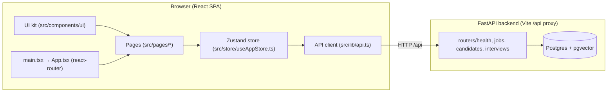

# The Interview Agent — Frontend Overview

Companion to [[Project Overview]] (which covers the Python/FastAPI backend). Read that
first for the milestone roadmap and the shared vocabulary (M0–M7). This note documents the
React frontend: what's built, which file does what, what's real vs. simulated, and the gaps
between the two halves.

Code lives at `frontend/` inside `/Users/amittiwari/Project/StatnativInterviewApp`.

## The single most important fact

> **The frontend now talks to the backend through a typed API layer.**

As of 2026-08-09 the two halves are finally connected. A typed fetch client
(`src/lib/api.ts`) is proxied by Vite (`/api` → `127.0.0.1:8000`), and the Zustand store
loads everything from Postgres via the API: **jobs, candidates, and interviews are no longer
seeded into localStorage**. `init()` fetches all three collections on app load; every
mutation calls the API and syncs the returned records back into the store. Refresh the page
and the data is still there — it lives in the database.

What remains frontend-local: the two hardcoded demo users (`seed.ts`), the PDF text
extraction (pdfjs, in the browser), and the screens that don't have backend endpoints yet
(voice/video sessions, avatar, anti-cheating logging). The backend server must be running
for the app to be useful.

## The mental model

Two worlds, connected by a REST API:

1. **The backend world** ([[Backend Overview]]) — FastAPI + Postgres + OpenRouter on
   `localhost:8000`. Owns all jobs/candidates/interviews data, scoring, and rubric
   generation.
2. **The frontend world** — a Vite dev server (`npm run dev`) serving a single-page React
   app. State lives in one global store (`useAppStore`) that is **seeded from the API at
   boot** and kept in sync by store actions that call the API. The store is still an
   in-memory cache of server state — no offline mode, no optimistic updates beyond what the
   API returns.



## Tech stack

| Concern | Choice | Why / notes |
|---|---|---|
| Build tool | Vite 6 | dev server on `localhost:5173` (was 5174 in this session), **proxies `/api` → `127.0.0.1:8000`** |
| Framework | React 19 + TypeScript | `@vitejs/plugin-react` |
| Router | react-router-dom v7 | `BrowserRouter` + `Routes` in `App.tsx` |
| Global state | Zustand 5 | one store, `create<AppState>()`, no middleware/persistence (persistence now lives in Postgres via the API) |
| Styling | Tailwind CSS v4 | via `@tailwindcss/vite`; design tokens in `src/index.css` via `@theme` |
| Class variants | class-variance-authority + tailwind-merge + clsx | `cn()` helper in `src/lib/utils.ts`; used for the `Button` variants |
| Icons | lucide-react | all icons imported inline per file |
| API client | hand-rolled `fetch` wrapper | `src/lib/api.ts`, typed per resource, base URL from `VITE_API_BASE` (defaults to `/api`) |
| PDF parsing | pdfjs-dist v4 | `src/lib/pdf.ts` — extracts text/name from uploaded resumes in the browser; worker loaded via `?url` |
| Lint | oxlint | `npm run lint` (no test script, no test framework — frontend tests are still a gap) |

## File-by-file map

### Entry / build config — read these first

| File | What it does |
|---|---|
| `vite.config.ts` | The `@` alias → `src/`, the two plugins (react, tailwind), **and the dev proxy: `/api` → `http://127.0.0.1:8000` with a rewrite that strips the `/api` prefix**. This is how the SPA reaches the backend in dev. |
| `src/main.tsx` | The true entry point. `createRoot(...).render(<App/>)` inside `<StrictMode>`. Imports `index.css` once. |
| `src/index.css` | The entire design system. Tailwind v4 `@theme` block defines the brand palette (`brand-primary` terracotta #be5a3c), status colors (strong/possible/weak/pending/info), radius scale, and the Inter font. Every `bg-status-strong-text` class you see in pages resolves here. |
| `index.html` | Vite's HTML shell — just the `<div id="root">` mount point. |
| `src/App.tsx` | The whole navigation map (see Routing below) **plus a `useEffect` that calls `store.init()` on mount** — the app is data-less until the first API load completes. |

### Routing — the skeleton

`src/App.tsx` is the whole navigation map. It is a flat `Routes` list (no nested layouts, no
route guards, no lazy loading). 27 paths, ~23 real pages + 4 placeholders + 2 redirects.
`App.tsx` also fires `store.init()` from a `useEffect` on mount — see below.

| Area | Routes | Page component |
|---|---|---|
| Auth / entry | `/` → redirects to `/login`; `/login`; `/candidate/login`; `/candidate` | `LoginOrg`, `LoginCandidate`, `LandingCandidate` |
| Org — dashboard | `/dashboard` | `Dashboard` |
| Jobs | `/jobs`, `/jobs/:jobId` | `JobsList`, `JobDetail` |
| Candidates (cross-job) | `/candidates` | `CandidatesList` — every candidate across every job, with filters/sort/bulk actions/CSV export |
| Candidates (per job) | `/jobs/:jobId/candidates`, `/candidates/:candidateId`, `/pipeline`, `/compare` | `RankedShortlist`, `CandidateDetail`, `PipelineBoard`, `ComparativeReport` |
| Interviews | `/interviews`, `/interviews/new`, `/interviews/:interviewId/edit`, `/persona-builder` | `InterviewsList`, `NewInterview`, `InterviewEditor`, `PersonaBuilder` |
| Session (candidate-facing) | `/session/:interviewId/consent`, `/device`, `/chat`, `/voice`, `/completed` | `OnboardingConsent`, `OnboardingDeviceCheck`, `ChatInterviewSession`, `VoiceInterviewSession`, `SessionCompleted` |
| Avatar (candidate-facing) | `/avatar/:interviewId/disclosure`, `/interview` | `AIDisclosure`, `AvatarVideoInterview` |
| Placeholders | `/practices`, `/sessions`, `/questions`, `/answer-bank` | `PlaceholderPage` (reused 4× with different props) |
| Master admin | `/admin/login`; `/admin` (nested: `/tenants`, `/users`, `/practice-tests`) | `AdminLogin`; `AdminShell` (route guard, wraps the nested routes via `<Outlet/>`) + `AdminTenants`, `AdminUsers`, `AdminPracticeTests` |
| Catch-all | `*` → redirects to `/login` | — |

The `/admin/*` subtree is nested under a parent `<Route path="/admin" element={<AdminShell/>}>`
rather than the flat top-level pattern every other route uses — `AdminShell` checks the session
once (`GET /auth/me`) and renders `<Outlet/>` for its children, so navigating between Tenants/
Users/Practice Tests doesn't re-check auth on every click. This is a deliberate exception to
"flat `Routes`, no nested layouts" above, scoped to the one subtree that actually needs a guard.

Patterns to learn from `App.tsx`:
- **URL query strings are used as "modal open" flags** — e.g. `/jobs?new=1` opens `NewJobModal`, `/interviews/:id/edit?share=1` opens the share modal. State that would normally live in React state is encoded in the URL via `useSearchParams`. Works, and makes links shareable, but means modal-open state is lost on refresh — acceptable for a prototype.
- All dynamic segments use `:interviewId`, `:jobId`, `:candidateId` and pages look those up in the store by `useParams()`.

### API layer — the new heart of the frontend

`src/lib/api.ts` is a thin typed wrapper over `fetch`:

- **Base URL**: `import.meta.env.VITE_API_BASE ?? "/api"` — overridable via a `.env` file, defaults to the Vite proxy.
- One function per endpoint, grouped per resource: jobs (`listJobs`, `createJob`, `patchJob`, `regenerateRubric`, `saveVersion`, `jobCandidates`), candidates (`listCandidates`, `createCandidate` (multipart with optional resume), `patchCandidate`, `screenCandidate`, `bulkUpdate`, `uploadResume`), interviews (`listInterviews`, `createInterview`, `patchInterview`).
- All response types are the backend's flat **view schemas** (`JobView`, `CandidateView`, `InterviewView`) — which match `src/data/types.ts` field-for-field.
- Errors bubble up as `Error` with the backend's `detail` message — pages that care show it (e.g. the duplicate-email error in `AddCandidateModal`).
- **New (M6 Phase 1/2)**: every request now carries `X-Tenant-Id` and `X-User-Email`, read via
  `useAppStore.getState()` inside `request()` — the standard way to reach a Zustand store from
  a plain module that isn't a React component. (This does create a real circular import between
  `lib/api.ts` and `store/useAppStore.ts`; it works because both bindings are only accessed
  lazily inside function bodies, never at module-evaluation time — confirmed via `npm run
  build`, but worth knowing if either file's top-level structure changes.)

### Master admin module — a separate, real-auth surface

`src/lib/adminApi.ts` is a **second, deliberately separate** typed fetch client, not an
extension of `lib/api.ts`. It sends `credentials: "include"` on every call and never the
`X-Tenant-Id`/`X-User-Email` headers — the session cookie set by `POST /auth/login` **is** the
identity here, which is the mechanical way this module stays isolated from the Phase 1/2 dev-
header flow the rest of the app still uses (see [[Identity & Access Overview]] addendum for
the backend side).

- `AdminLogin.tsx` — a **real** login form (unlike `LoginOrg.tsx`, which still just
  `navigate()`s on submit): calls `adminApi.login`, shows the backend's generic "incorrect
  username or password" on 401, navigates to `/admin/tenants` on success.
- `AdminShell.tsx` — the app's **first real route guard**. On mount it calls `adminApi.me()`;
  while that's pending it shows a "Checking session…" state, then either renders the sidebar
  shell (Tenants/Users/Practice Tests nav + sign-out) with `<Outlet/>`, or `<Navigate
  to="/admin/login" replace/>` on a 401. Every other shell in the app (`OrgAppShell`,
  `CandidateShell`) trusts whatever's in the store — this is the only one that asks the server.
- `AdminTenants.tsx` / `AdminUsers.tsx` / `AdminPracticeTests.tsx` — simple list + create-modal
  pages, reusing the existing `Card`/`Modal`/`Button`/`Input` UI kit rather than inventing new
  primitives. `AdminUsers` additionally renders Approve/Disable buttons per row driven by the
  user's `status`. All three fetch on mount with local `useState`/`useEffect` — no Zustand
  store involvement, matching the module's separation from the rest of the app's state.

**Not built (matches the backend scope decision):** Google/SSO login — the plan explicitly
deferred it since there was no way to obtain real OAuth credentials in this session; there's no
placeholder button for it here, unlike the decorative-but-visible "Google"/"Microsoft" buttons
on `LoginOrg`/`LoginCandidate`.

### State layer — API-backed now

`src/store/useAppStore.ts` is a single Zustand store holding: `currentUser` (now carries a
`role`), `currentCandidate`, `currentTenant` (**new**, M6 Phase 1 — seeded to match the
backend's `SEED_TENANT_ID`), `jobs[]`, `candidates[]`, `interviews[]`, plus the actions that
mutate them.

| Action | What it really does |
|---|---|
| `init()` | `Promise.all` of `listJobs` + `listCandidates` + `listInterviews`, then a single `set({jobs, candidates, interviews, ready: true})`. Called once from `App.tsx` on mount. Sets `ready`/`error` (both new fields on `AppState`) — on failure `error` holds the message and `ready` still flips true so pages don't spin forever. |
| `createJob` / `createInterview` | Call the API (the backend generates the rubric for a job, creates the interview), then prepend the returned record. |
| `addCandidate` | Calls `api.addCandidate` (multipart-shaped JSON: name/email/phone/source/resumeText). Score, scorecard, strengths/gaps, compareVerdict, and aiNote all come from the backend's deterministic screening (`app/services/screening.py`) — no client-side `Math.random()` left. **Returns `{candidate, duplicate?}`**: on a `409` the backend returns the pre-existing candidate instead of throwing, and the store passes it back as `duplicate` *without* inserting a second record — `AddCandidateModal` renders a "Duplicate email detected" panel with the existing candidate's name/score instead of a generic error. |
| `updateCandidate` | New: `patchCandidate` for the profile fields (`phone`, `source`, `tags`, `notes`, `location`) that aren't decision/stage/shortlist. |
| `updateJobStatus` / `generateRubric` / `saveJobVersion` | `patchJob` / `regenerateRubric` / `saveJobVersion` round-trips, then upsert the response. `generateRubric` additionally re-fetches `listJobCandidates(jobId)` and swaps that job's candidates wholesale, because regenerating a rubric re-screens every application server-side. |
| `screenCandidate` | New: re-runs screening for one candidate on demand (`POST /candidates/{id}/screen`), upserts the result. Not yet wired to a button anywhere in the UI. |
| `judgeCandidate` / `pollCandidate` | **New (M2/IA-003) — LLM-as-judge, off the request path.** `judgeCandidate` fires `POST /candidates/{id}/judge`, which now returns almost instantly with a **`pending`** snapshot (not a finished result) — upserted like anything else. `pollCandidate` is the new piece: a thin `api.getCandidate` wrapper, called on a timer by `CandidateDetail` (below) while `judgeStatus === "pending"`, upserting whatever the server has each time until it resolves to `"idle"` (done) or `"failed"`. |
| `rescreenJob` | New: re-fetches a job's candidates from the API (used after a rubric change elsewhere in the flow); no direct UI trigger yet either. |
| `toggleShortlist` / `setDecision` / `movePipelineStage` | Single-candidate `patchCandidate`, then upsert. |
| `bulkToggleShortlist` / `bulkSetDecision` / `bulkMoveStage` | New: `api.bulk(candidateIds, action, value)` → `POST /candidates/bulk`, replacing the affected candidates in the array in one `set()`. Power the multi-select toolbar on `CandidatesList` (`components/candidates/CandidateToolbar.tsx`'s `BulkToolbar`). |
| `addQuestion` / `removeQuestion` | `updateInterview` with the edited question list, then replace that interview in the array. |

Notes for learning:
- **Persistence is Postgres now.** The store has no `persist` middleware — durability moved
  to the backend's database. A refresh reloads from the API instead of resetting to seed.
- **The store is a cache, not the source of truth.** Every mutation round-trips to the API
  and adopts the server's response. This is the correct pattern for a single-client app and
  means the UI stays consistent even when the server normalizes/derives fields.
- **Selectors are plain functions** (`getJob`, `getCandidatesForJob` which also sorts by
  descending score, `getCandidate`) — recomputed each render from the arrays, not memoized.
- **Domain logic lives in the store, not the components.** Pages only read state and call
  actions; they never mutate arrays directly. That's the clean separation to imitate.

### Data layer — mostly server-owned now

| File | What it does |
|---|---|
| `src/data/types.ts` | Every domain type: `Job`, `Candidate`, `Interview`, `InterviewQuestion`, `ChatMessage`, `PipelineStage`, etc. **Aligned with the backend's view schemas** — the old schema-divergence gap is closed (the backend was migrated to match). |
| `src/data/seed.ts` | Now only the two hardcoded demo users (`orgUser` = Riley Hoffman @ Northwind Health, `candidateUser` = Sophia Martinez) — the last local-only data. |
| `src/data/generated-seed.ts` | The old seed corpus (37 jobs, 228 applications, 90 people with PDF resumes). No longer imported by the app — it's the **seed source for the database** (`python -m app.seed` loads it into Postgres). Regenerated by `scripts/synthetic/convert/to_frontend_seed.py`. |
| `src/lib/pdf.ts` | pdfjs-dist wrapper: `extractTextFromPdf(file)` → `{text, pageCount}`, `readPdfName(filename)`. Used by `AddCandidateModal` for the resume upload. |
| `src/lib/scoring.ts` | The original frontend scorer (`deriveScore` etc.) — **no longer on the runtime path** (screening moved server-side), kept as the reference implementation the Python port was validated against. |
| `src/lib/candidates.ts` | `CandidateFilters` type + `defaultFilters` + `filterCandidates()` — the filter/sort engine behind `CandidatesList` (query, pipeline stage, decision, score band via `scoreBand()`, source, sort key/direction). Pure functions, no store dependency, easy to unit test if `Next up`'s Vitest work happens. |
| `src/lib/export.ts` | `candidatesToCsv(candidates, jobById)` + `downloadCsv(filename, csv)` — builds a 14-column CSV (name/email/phone/location/job/department/score/verdict/stage/decision/shortlisted/source/years-exp/applied) and triggers a browser download via a Blob + temporary `<a>`. No server round-trip. |
| `src/lib/skills.ts`, `src/lib/utils.ts` | The skill dictionary (also extracted into the backend's `skill_dictionary.py`), and `cn()`/`initials()`/`formatRelativeTime()`. |

### Component layer

**Layout shells** (`src/components/layout/`):
- `OrgAppShell.tsx` — the recruiter side's left sidebar (8 nav items, 4 lead to real pages:
  Dashboard, **Candidates** (new — cross-job list), Interviews, Jobs; the rest hit
  placeholders) + user footer, plus the reusable `PageTopbar` (breadcrumb + title + actions
  row) used by almost every org page.
- `CandidateShell.tsx` — the candidate side's minimal top bar with the candidate's name/avatar
  (`minimal` prop hides the name for onboarding pages).

**UI kit** (`src/components/ui/`): `Button`, `Card`, `Input` (exports `Input`, `Label`,
`Textarea`), `Modal`, `Badge`, `Avatar`, `ScorePill`. All pure presentational components —
no domain logic. `Button` is the richest example of the cva variant pattern (6 variants × 4
sizes). `Modal` uses `createPortal` to `document.body`, ESC-to-close, and scroll-lock.
`ScorePill` also exports `scoreTone(score)` (≥80 strong, ≥55 possible, else weak) reused by
`CandidateDetail`.

**Candidates toolbar** (`src/components/candidates/CandidateToolbar.tsx`) — new, built for
`CandidatesList`: `FilterBar` (search + stage/decision/source `<select>`s + strong/possible/weak
`FilterChip`s + `SortSelect`), `BulkToolbar` (renders nothing when nothing is selected;
otherwise shortlist/unshortlist toggle, approve/hold/reject, a "move to stage" `<select>`, and
a clear-selection link), and `ScoreBadge`. All presentational — filtering/sorting logic lives
in `lib/candidates.ts`, bulk API calls live in the store.

### Pages — by product area

**Recruiter side (in `OrgAppShell`):**
| Page | Real functionality | Simulated/fake parts |
|---|---|---|
| `Dashboard` | Computes stat cards from store (open jobs, total candidates, avg score, shortlisted); lists first 3 jobs with candidate counts — **live DB numbers** | "Recent activity" feed is a **hardcoded array** in the file; "↑ +12 this week" captions are static text |
| `JobsList` | Search filter, table of jobs, candidate counts, status badges, opens new-job modal | — |
| `JobDetail` | Status switcher (Draft/Open/Paused/Closed) wired to `patchJob`; shows rubric with auto-summed total weight; version history; **"Regenerate rubric" calls `generateRubric(job.id)` → `POST /jobs/{id}/regenerate-rubric`**; **"Save version" calls `saveJobVersion`**; add-candidate entry | — |
| `NewJobModal` | `createJob()` calls the API — **the backend really generates a 4-criteria rubric from the JD** (via `screening.generate_rubric`) | — |
| `AddCandidateModal` | **Real PDF upload**: hidden file input + FileUp button, extracts text in the browser (`extractTextFromPdf`), shows page count, `parseError` on unreadable files; also captures phone + source (7-option dropdown, defaults "Manual Entry"). Submit calls `addCandidate` → on success the modal **switches to a result panel** in place (score, verdict badge, criteria count, aiNote, matched-skills chips) instead of just closing; on a duplicate email it switches to a **different** panel naming the existing candidate (name/score) instead of creating a second record | — |
| `CandidatesList` | New — the `/candidates` nav item. Every candidate across every job in one table: `FilterBar` (search/stage/decision/score-band/source/sort), row checkboxes + "select all shown", `BulkToolbar` (shortlist/approve/hold/reject/move-stage on the selection via the store's `bulk*` actions), and an **Export CSV** button (`lib/export.ts`, client-side, no backend call). Each row also shows the job title/department (via a `jobId → Job` map) and the candidate's `source` badge | Row click still routes to the per-job `CandidateDetail` (`/jobs/:jobId/candidates/:candidateId`) — there's no `/candidates/:id`-only route |
| `RankedShortlist` | Lists a job's candidates sorted by score, search, shortlist/decision badges | — |
| `CandidateDetail` | Shortlist / Approve / Hold / Reject buttons wired to the store; scorecard bars; strengths/gaps/aiNote; **real** copy-link button (`navigator.clipboard.writeText`, with a `document.execCommand("copy")` fallback for non-secure contexts) copying a shareable `/jobs/:jobId/candidates/:candidateId` URL, brief "Copied" state; tag add/remove via `updateCandidate({tags})`; **AI Judge button (M2/IA-003)** — `handleJudge` fires `judgeCandidate` and returns immediately, no inline await; a `useEffect` (declared unconditionally before the component's early returns, per the rules of hooks) starts a 2s-interval `pollCandidate` loop while `candidate.judgeStatus === "pending"`, capped at ~30 polls (~60s) so a genuinely stuck job stops polling rather than running forever; button label/disabled state and the scorecard's "AI Judging…"/"AI Judged" badges read `candidate.judgeStatus`/`scoreMethod` directly off the store — **server-persisted, not local `useState`**, so navigating away mid-judge and back still shows the correct pending/failed/done state (the old local-state version would have reset). A failed judge surfaces `candidate.judgeError` in the same error slot a synchronous request-level error (400/404/409) uses, kept in a separate `requestError` local variable so the two don't get confused. | — |
| `PipelineBoard` | A real kanban — native HTML5 drag & drop moves candidates between the 5 stages via `movePipelineStage` (bulk-patched to the API) | — |
| `ComparativeReport` | Renders candidate cards with strengths/concerns/evidence | "Panel summary" prose and the verdicts come straight from seed data; "Print/PDF" and "Regenerate" buttons are decorative |
| `InterviewsList` | Grid of interviews with mode icon, status, question count, shared flag — **loaded from the API** | — |
| `NewInterview` | **Real AI generation (M3)**: mode picker, job select (now keyed by `job.id`, not title), an optional candidate picker sourced from that job's applicants (`api.listJobCandidates`) that personalizes the generated questions, `createInterview` triggers a real backend LLM call | — |
| `InterviewEditor` | **Real edit/reorder/regenerate (M3)**: add/remove/edit questions (text + type + difficulty) wired to `patchInterview`, drag-to-reorder via the `GripVertical` handles (native HTML5 DnD, same pattern as `PipelineBoard`), per-question and regenerate-all buttons that call the backend, a "Personalized for {name}" badge when the interview has a `candidateId`, share modal via `?share=1` | Regenerate buttons are disabled (with a tooltip) when the interview has no linked job — an interview created before M3, or via the old flow |
| `ShareInterviewModal` | Toggle `shared` flag + clipboard copy | Link is fake: `https://app.statnativ.com/i/{id}` — no real URL routing, no access control |
| `PersonaBuilder` | Full form for name/appearance/voice/tone/intro + live preview | **Nothing is saved** — "Save persona" just shows a 1.5s "Saved" state |

**Candidate-facing sessions (in `CandidateShell` or full-screen):**
| Page | Real functionality | Simulated/fake parts |
|---|---|---|
| `OnboardingConsent` | 4 consent checkboxes; button disabled until all checked; routes to device check | Consents recorded nowhere |
| `OnboardingDeviceCheck` | **Real** `navigator.mediaDevices.getUserMedia` — shows live camera feed, reports camera+mic as Working/denied, stops tracks on unmount | — |
| `ChatInterviewSession` | Working linear chat: AI asks each question in order, candidate types answers, timer runs, auto-advances; **real** anti-cheating via `visibilitychange` | Answers aren't sent anywhere; AI "responses" are just the next question from the interview's array |
| `VoiceInterviewSession` | Timer, animated waveform, tap-to-record/stop, advances questions | ⚠️ **Recording is completely fake** — no mic ever opens, no audio is captured; the waveform is a `Math.sin` animation |
| `AvatarVideoInterview` | **Real** `getUserMedia` for the candidate's self-view pip; speaking pulse animation; mute/next/hang-up controls | The "AI avatar" is a static `Bot` icon — no video, no WebRTC, no AI |
| `SessionCompleted` | Summary card (questions answered, mode) | — |

**Cross-cutting:** `AntiCheatingModal` (shown whenever the tab becomes hidden during a session)
warns "this has been logged and will be visible to the hiring team" — but nothing is logged
anywhere; the counter only lives in the session's local `useState`.

## Trace: add a candidate through the UI (the full-stack path)

The classic end-to-end path, now crossing both halves:

1. `/jobs` → `JobsList` renders table from `useAppStore(s => s.jobs)` (loaded by `init()` from `GET /jobs`).
2. "Add candidate" → navigates `/jobs/:jobId?add=1` → `JobDetail` reads `?add` and renders `AddCandidateModal`.
3. Optionally pick a **PDF** → `extractTextFromPdf` (pdfjs in the browser) fills the resume text field.
4. Submitting calls `addCandidate(jobId, {name, email, phone, source, resumeText})` →
   `api.addCandidate` → `POST /candidates`. The backend dedupes by email (case-insensitive)
   and either **screens deterministically** — returns the candidate with
   score/scorecard/strengths/gaps/aiNote — or, on a duplicate, returns the existing candidate
   with a `duplicate: true` flag instead of a bare `409`.
5. The store upserts the returned candidate (skipped entirely on the duplicate path — no
   second record). The modal **doesn't auto-close** — it swaps to a result panel: a
   score/verdict/matched-skills summary on success, or a "duplicate email detected" panel
   naming the existing candidate. The user clicks **View candidates** (→
   `navigate('/jobs/:jobId/candidates')`) or **Close**.
6. `RankedShortlist` re-reads via `getCandidatesForJob(jobId)` (re-sorts by score) and the new
   candidate appears; it's also visible immediately in the cross-job `/candidates` list.
7. Refresh the page: the candidate is still there — it was persisted to Postgres.

## Trace: candidate takes a Chat interview

1. Share modal copies `https://app.statnativ.com/i/{id}` (fake) — in reality a candidate would
   open `/session/:interviewId/consent`.
2. `OnboardingConsent` → `OnboardingDeviceCheck` (real camera/mic test) → routes by
   `interview.mode`: Voice → `/voice`, everything else → `/chat`.
3. `ChatInterviewSession` reads `interview.questions` from the store, posts question 1 as an
   AI message, and each submitted answer advances the local `step` index. On the last question
   it navigates to `/session/:interviewId/completed`.
4. `SessionCompleted` shows a summary. **No transcript, no audio, no evaluation is produced or
   stored** — the backend's `interview_pipeline` (STT→LLM→TTS) has no frontend client yet.

## Feature truth table (what's real vs. smoke-and-mirrors)

| Feature | Real? | Where |
|---|---|---|
| Client-side navigation, 23 pages | ✅ | `App.tsx` |
| Zustand global state + immutable updates | ✅ | `store/useAppStore.ts` |
| Jobs / candidates / interviews **persisted via API** | ✅ | store actions → `lib/api.ts` → Postgres |
| Candidate screening score | ✅ **real — deterministic, server-side** (no more `Math.random()`) | `POST /candidates` → `app/services/screening.py` |
| Rubric generation from JD | ✅ **real** (4 criteria from the JD, server-side) | `NewJobModal` / `JobDetail` → `POST /jobs/{id}/regenerate-rubric` |
| Resume upload/parsing | ✅ real PDF upload + browser text extraction | `AddCandidateModal` + `lib/pdf.ts` |
| AI question generation, edit/reorder/regenerate | ✅ **real** (M3) — server-side LLM call, optional per-candidate personalization, drag reorder, per-question and regenerate-all | `NewInterview` / `InterviewEditor` → `app/services/question_generator.py` |
| Voice recording | ❌ never opens the mic | `VoiceInterviewSession` |
| AI avatar video interviewer | ❌ static icon (self-view is real) | `AvatarVideoInterview` |
| Anti-cheating detection | ✅ detection works, ❌ nothing logged | session pages |
| Auth | ❌ forms just `navigate()` | `LoginOrg`/`LoginCandidate` |
| Persistence | ✅ via Postgres; ❌ no offline mode | store + API |

## Gaps — frontend vs. backend

### 1. ~~No API layer~~ — resolved (2026-08-09)
The `src/api/` client + Vite proxy + API-backed store described below are now built, and the
backend gained the endpoints to back them (full CRUD for jobs/candidates/interviews). **What
remains:** error/retry handling (the client throws raw `Error`s), a loading state beyond the
initial `init()` (individual pages assume data is loaded), and test coverage for the client.

### 2. ~~Schema mismatch between the two halves~~ — largely resolved
The backend was migrated (`a1b2c3d4e5f6`) to match the frontend's contract: jobs now have
`rubric`/`versions`, candidates have the full profile (`skills`, `summary`, `experience`,
`education`, `certifications`, …), applications carry the screening outputs, and the
`interviews` table now exists (this was decision **D2** from the architecture review). The
view schemas match `src/data/types.ts` field-for-field. **Remaining divergence:** no
`interview_turns`/`questions` tables (questions are JSONB on interviews), and `tenant_id`
doesn't exist anywhere (D3) — consistent with single-tenant, but the frontend already
renders an org-agnostic app with hardcoded "Northwind Health".

### 3. Fake AI in the session/voice/avatar areas mirrors unbuilt milestones
Screening, rubric generation, and question generation (M3) are now real; the voice cascade (M4)
still isn't: session pages never capture real audio, and the avatar is a static icon. M3
shipped exactly the shape this note predicted — the store actions swapped seeded/canned logic
for real calls without changing the UI's structure. Same should hold for M4.

### 4. No auth for tenant users (consistent with backend M6) — partially addressed by Phase 1/2; a real (but separate) login now exists for the platform admin
`LoginOrg`/`LoginCandidate` still navigate straight to `/dashboard`/`/candidate` — no token, no
route guard, no real `currentUser` switching (the store still hardcodes Riley/Sophia; only
their `role`/tenant fields are new). What changed: `currentUser.role` and `currentTenant` are
now real, meaningful values that the backend's `require_roles`/`get_current_tenant`
dependencies actually check (M6 Phase 1/2 — see [[Identity & Access Overview]]), and mutating
buttons across `JobsList`/`JobDetail`/`CandidateDetail`/`CandidatesList`/`RankedShortlist` are
disabled for the `hiring_manager` role via a `canWrite()` helper (`lib/utils.ts`) — cosmetic
only, the server 403 is the real boundary. **Separately**, `/admin/*` now has a real
session-cookie login and the app's first real route guard (`AdminShell` — see above), but that
is scoped to the one platform-admin account, not tenant users; `App.tsx` still has no guard on
`/dashboard`/`/jobs`/etc. — that remains Phase 3's job alongside real tenant-user login.

### 5. No frontend tests
`package.json` has `dev/build/lint/preview` — there is **no test script and no test file**.
The backend gained `tests/test_screening.py` (9 tests, plus health = 10 total, all passing); the frontend has no
equivalent. When you touch `lib/api.ts` or the store, that's the moment to add Vitest.

## Real gotchas worth remembering

1. **Modal-on-URL pattern** (`?new=1`, `?add=1`, `?share=1`) is clever but means a refresh
   while a modal is open silently loses it. Fine for prototypes; a real app would either keep
   modal state in the store or accept the tradeoff.
2. **`useSearchParams` mutation must use `{ replace: true }`** — the close handlers do
   `params.delete(...)` then `setParams(params, { replace: true })` to avoid polluting browser
   history with a back-button that reopens a modal. Copy this pattern.
3. **`StrictMode` double-invokes effects in dev.** Session pages register
   `document.addEventListener("visibilitychange", ...)` inside `useEffect` with proper cleanup,
   so it survives; if you add listeners without cleanup you'll get duplicate handlers in dev.
4. **The store is a cache now.** Because `init()` replaces the whole collections and mutations
   upsert server responses, an action that returns a stale/partial record will visibly clobber
   UI state. The backend's view schemas returning the full record is what keeps this safe —
   don't shrink them.
5. **`getUserMedia` requires a secure context** — works on `localhost` but will need HTTPS once
   the frontend is deployed (ties into backend M6b deploy milestone).
6. **`index.css` is the source of truth for the color system.** New UI that wants the brand's
   terracotta/status colors must use the `@theme` tokens (`brand-primary`, `status-strong-text`,
   …) rather than hardcoding hex — otherwise the design system forks.
7. **Never seed `useState` from a store array at the initializer** — `useState(jobs[0]?.id ??
   "")` only ever sees the store's value at first render, which is `[]` before `init()`'s API
   call resolves. `NewInterview.tsx` had exactly this bug (found during M3): the job `<select>`
   *looked* correctly selected — the browser's no-match fallback rendering shows the first
   `<option>` regardless — but the real state stayed `""` forever, so nothing was ever actually
   linked. Harmless before M3 (nothing depended on the value); load-bearing after, once
   generation started requiring a real `jobId`. Fix: seed the value from a `useEffect` keyed on
   the array once it arrives, not from the `useState` call itself.

## How to run

The backend must be up first (see [[Runbook]]: Docker Postgres → `alembic upgrade
head` → `python -m app.seed` → `uvicorn app.main:app --port 8000`). Then:

```bash
cd "/Users/amittiwari/Project/StatnativInterviewApp/frontend"
npm install          # once
npm run dev          # Vite dev server → http://localhost:5173 (5174 if taken)
npm run build        # tsc -b && vite build (type-checks + bundles)
npm run lint         # oxlint
```

Navigate the app:
- `/login` → any email/password → `/dashboard` (recruiter world)
- `/candidate/login` → `/candidate` (candidate world)
- Try `/session/int-backend-tech/consent` to walk the full candidate interview flow
  (or `/avatar/int-sre-oncall/disclosure` for the avatar flow).
- `/admin/login` → real credentials (`statnativ` / seeded password, see [[Runbook]]) → `/admin`
  (master admin world — tenants/users/practice tests). This is a genuinely separate login, not
  a click-through — a wrong password is really rejected.

## Next up

The API layer is in. Natural next steps, roughly in order of value:

1. **Frontend tests** — Vitest for `lib/api.ts` (mock fetch) and the store actions (mock API
   module) to lock in the client–server contract.
2. **Guard rails** — a loading/error state at the route level (the pages currently assume
   `init()` finished), plus a 409-conflict UX for duplicate emails beyond the add-candidate
   modal.
3. Then the M4 voice/session wiring, which keeps the UI shape and replaces the fake recording
   with the real cascade calls.