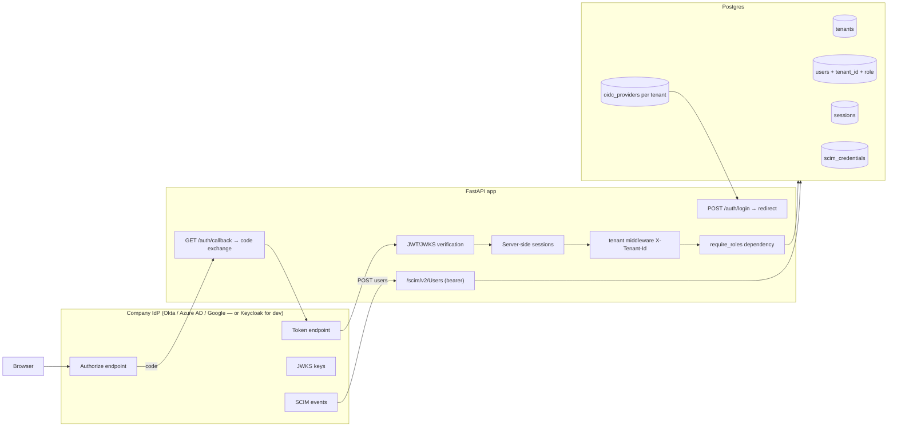

# The Interview Agent — Identity & Access (M6) Plan

The implementation plan for the enterprise requirements: **SSO (OIDC-first), SCIM 2.0
provisioning, MFA, RBAC with custom roles, and tenant isolation.** Companion to
[[Project Overview]] (roadmap) and [[Backend Overview]] (the code this builds on). The
protocol and build-vs-buy decisions are recorded in **ADR-005** and **ADR-006**
(`docs/architecture/decisions/`).

Layman's version of every term (SSO, OIDC, SAML, SCIM, MFA, RBAC, tenant) is in the
conversation that produced this plan; the short form:

- **SSO** = the app asks the company's identity provider ("who is this person?") and trusts
  its signed answer. OIDC = modern JSON-token flavor; SAML = legacy XML flavor.
- **SCIM** = an API the IdP calls to push account lifecycle events (hire/promote/fire).
- **MFA** = inherited from the IdP, not built natively — we check the token's MFA claims.
- **RBAC** = who may do what, enforced server-side (roles exist today but nothing enforces them).
- **Tenant isolation** = one company's data can't leak into another's.

## Current state (updated 2026-08-09 — Phases 1 & 2 shipped; master admin module added)

| Requirement | Status today                                                                                                                        |
| ----------- | ----------------------------------------------------------------------------------------------------------------------------------- |
| SSO         | ❌ Still no real auth **for tenant users** — `X-Tenant-Id`/`X-User-Email` headers remain dev-mode stand-ins (see Phase 1/2 below), not a login. A real session-cookie login exists, but only for the one **platform admin** account (see addendum below) — it does not touch or advance tenant-user SSO. |
| SCIM        | ❌ None                                                                                                                              |
| MFA         | ❌ None (follows from no real auth)                                                                                                  |
| RBAC        | ✅ **Enforced** — `app/services/authz.py` permission matrix + `require_roles` dependency on every route (`tests/test_rbac.py`, 19 tests) |
| Tenants     | ✅ **Resolved (D3)** — `tenants` table + `tenant_id` on 6 models, `(tenant_id, email)` composite uniques, every query scoped (`tests/test_tenant_isolation.py`, 6 tests) |
| Master admin| ✅ **Shipped** — real email/password login + session cookie for one cross-tenant admin account; creates tenants, creates/approves/disables users, authors tenant-scoped Practice Tests. See addendum below. |

## Sequencing rationale (agreed)

1. **Tenant isolation first** — retrofitting `tenant_id` after real data exists is the most
   expensive change in this list (D3's warning: the email-unique constraints will have real
   data depending on them). The schema is still young; one seed tenant exists.
2. **RBAC second** — enforcement needs an identity to enforce *for*, so it lands with the
   first auth layer, but the *role model* itself is schema-independent and can ship before SSO.
3. **SSO (OIDC) third** — the visible enterprise feature; builds on tenants (per-tenant IdP
   config) and identity.
4. **SCIM last** — the biggest, most tangential build; gated on tenants + auth being real.

## Target architecture

Design notes (deliberate choices, all teachable):
- **Per-tenant IdP config** (`oidc_providers` table) — each company connects *its own* Okta/
  Azure AD. This is what makes SSO "multi-tenant SSO" rather than a single hardcoded login.
- **Server-side sessions + signed cookie** (revocable) rather than pure stateless JWT — the
  teachable tradeoff is "JWT you can't revoke".
- **`X-Tenant-Id` header in dev** (subdomain-based resolution documented as the prod strategy).
- **Keycloak in Docker as the dev/CI IdP** — free, real OIDC + SCIM behavior, matches the
  existing docker-compose pattern (see ADR-006).

## Phase plan

### Phase 0 — Record decisions (docs only)
- ADR-005 (OIDC-first, SAML later) and ADR-006 (build-vs-buy; SCIM narrow scope) written and
  accepted.
- Update the roadmap (`users.role` note), risk register (D3 resolved → "in progress").
- **Deliverable:** two ADRs + this note linked from [[_Home]].
- **Verify:** docs review only.

### Phase 1 — Tenant isolation (resolves D3) — ✅ Shipped 2026-08-09
*Concept: multi-tenancy models, row-level isolation, retrofitting constraints while data exists.*

- **Schema**: migration `c3d4e5f6a7b8` (`migrations/versions/`) — new `tenants` table
  (`app/models/tenant.py`); `tenant_id` (FK, indexed) added to `users`, `jobs`, `candidates`,
  `resumes`, `applications`, `interviews`. `users.email`/`candidates.email` moved from global
  `UNIQUE` to `UNIQUE (tenant_id, email)` — the exact constraint surgery D3 flagged, done by
  hand (three-step add-nullable → backfill → not-null pattern, not autogenerate) while only
  one tenant's data existed.
- **Seed**: `app/seed.py` creates/fetches the **Northwind Health** tenant
  (`SEED_TENANT_ID` in `app/deps.py`) first and stamps it onto every row it creates, including
  a real seed `User` row (`riley@northwindhealth.com`, recruiter) that didn't exist before this
  pass — the seed script previously only *looked up* a user, never created one.
- **Backend**: `get_current_tenant` (`app/deps.py`) reads `X-Tenant-Id`, defaults to the seed
  tenant; every query in `app/routers/{jobs,candidates,interviews}.py` is tenant-scoped;
  cross-tenant lookups 404 (never a different status that would leak existence).
- **Tests**: `tests/test_tenant_isolation.py` (6 tests) — cross-tenant leak checks for
  jobs/candidates/interviews, same-email-different-tenant (the actual point of the constraint
  change), unknown-tenant 404, missing-header-defaults-to-seed-tenant.
- **Frontend**: `useAppStore.currentTenant` (seeded in `data/seed.ts`, must match
  `SEED_TENANT_ID`); `lib/api.ts`'s `request()` sends `X-Tenant-Id` on every call via
  `useAppStore.getState()`.
- **Found and fixed along the way** (not originally scoped, but necessary): the repo had no
  DB-backed tests before this, which surfaced two latent bugs — `pytest-asyncio`'s default
  per-test event loop doesn't match the module-level async engine's loop (fixed via
  `pytest.ini` + `pytest.mark.asyncio(loop_scope="session")`), and `GET
  /jobs/{id}/candidates` referenced a non-existent `Application.candidate` ORM relationship
  (dead `selectinload` call, removed — the query already selects `Candidate` directly).

### Phase 2 — RBAC enforcement (authz, before SSO) — ✅ Shipped 2026-08-09
*Concept: authentication vs authorization, least privilege, 401 vs 403.*

- Permission matrix in `app/services/authz.py` (data, not scattered `if role ==`): **Admin**
  and **Recruiter** get full jobs/candidates/interviews CRUD; **Hiring Manager** gets read-only
  jobs/candidates plus full interview management. (One deviation from the original wording
  here: the PRD's "hiring manager decides on candidates" need is served by read access to the
  evidence-backed scorecard, not write access to decision fields — flagged in the matrix's own
  docstring as a product decision to revisit deliberately, not a default-open choice.)
- **Backend**: `get_current_user` (`app/deps.py`) resolves identity from an **`X-User-Email`**
  header, not `X-User-Id` as originally sketched — the frontend's `OrgUser` has no id field,
  only email, so this avoids adding one just for this. `require_roles(*roles)` dependency
  factory: 401 if no user resolves (unknown email), 403 if role isn't allowed. Both live next
  to `get_current_tenant` with the same shape, ready for Phase 3 to swap in real session-backed
  identity without touching any route handler.
- **Tests**: `tests/test_rbac.py` (19 parametrized tests) — every route class × every role,
  plus the unknown-email 401 case.
- **Frontend**: `OrgUser` gained a `role` field (seeded `"recruiter"`); a `canWrite(role)`
  helper (`lib/utils.ts`, mirrors `WRITE_ROLES`) disables (not hides — consistent with how the
  SSO buttons were already treated) mutating buttons across `JobsList`, `JobDetail`,
  `CandidateDetail`, `CandidatesList`, `RankedShortlist` for the hiring-manager role. Cosmetic
  only, per the plan — `require_roles` is the real boundary; verified live by temporarily
  switching the seeded role and confirming the same buttons the server would 403 on are
  visibly disabled.
- **Deliverable:** shipped without waiting on login, exactly as planned — roles are seeded on
  the seed user (and on throwaway per-role users in the RBAC test fixture).

### Addendum — Master admin auth module (shipped 2026-08-09, out-of-sequence)

*Not a phase in the sequence above.* This is a **separate, narrower** real-auth surface for
one cross-tenant operator account, built ahead of Phase 3 because the immediate need was
platform-side tenant/user provisioning, not tenant-facing SSO. It does **not** advance or
substitute for Phase 3 — every tenant-facing route (`OrgAppShell`/`CandidateShell`, all
jobs/candidates/interviews routes) is untouched and still authenticates via the
`X-Tenant-Id`/`X-User-Email` dev headers exactly as Phase 1/2 left them. Confirmed live: the
existing recruiter dev-login flow and the new admin login flow were exercised side-by-side
with no interference, and the Playwright regression suite (`frontend/e2e/ux-audit.mjs`) showed
the same 10 PASS / 5 FAIL (5 pre-existing, unrelated gaps) as before this work.

- **Identity model**: no new `platform_admins` table. `users.tenant_id` was made nullable, and
  a platform admin is a `users` row with `tenant_id = NULL`, `is_platform_admin = true` — a DB
  `CHECK` constraint (`ck_users_platform_admin_no_tenant`) enforces the two are always paired,
  so the invariant can't be violated by an application bug. `username`/`password_hash` columns
  added (nullable — only admin-managed accounts use them); `uq_users_username` is a **partial**
  unique index (`WHERE username IS NOT NULL`) so it doesn't constrain the many tenant users that
  still have no username. A `status` column (`pending`/`active`/`disabled`) replaces the
  previous implicit "every user is active" assumption.
- **Login is email/password only — Google/SSO explicitly deferred.** The user asked for
  "login using google and email"; Google was scoped out for this pass because there was no way
  to obtain real OAuth client credentials in this session. Nothing was stubbed in for it —
  there's no dead Google button or inert route, it simply isn't built yet. If/when it's picked
  up, it's additive to `app/routers/auth.py`, not a rework.
- **No public signup.** The admin creates tenant users directly (`POST /admin/users`, starts
  `status="pending"`); "approve" (`POST /admin/users/{id}/approve`) is what activates an
  admin-created account, not a self-registration confirmation.
- **Sessions**: new `sessions` table — `id` (UUID) doubles as the opaque cookie value itself,
  not a hash of it. **Deliberate POC simplification, not an oversight**: a real production
  hardening pass (Phase 6 above) would hash the token so a DB read alone can't mint a valid
  session. 7-day TTL, `HttpOnly` + `SameSite=Lax` cookie (not `Secure`, since local dev has no
  HTTPS).
- **Backend**: `app/deps.py::require_platform_admin` (cookie → `Session` lookup → `User`,
  401 if missing/expired/not an active platform admin) sits alongside — doesn't touch —
  `get_current_tenant`/`get_current_user`/`require_roles` from Phase 1/2. `app/routers/auth.py`
  (`POST /auth/login`, `POST /auth/logout`, `GET /auth/me`) and `app/routers/admin.py`
  (`/admin/tenants`, `/admin/users` + approve/disable, `/admin/practice-tests` — every route
  behind `require_platform_admin` at the router level) are new, additive routers.
- **Practice Tests are tenant-specific**, not global — new `practice_tests` table
  (`tenant_id` FK NOT NULL), the admin picks a tenant per test, same pattern as every other
  tenant-scoped model from Phase 1.
- **Seed**: `app/seed.py` idempotently creates the one seed platform admin
  (`statnativ`, bcrypt-hashed password) — plaintext credentials live only in the conversation
  that requested this and the seed call itself, never logged or returned by any endpoint.
- **Frontend**: `AdminLogin.tsx` (real form, not the decorative click-through pattern
  `LoginOrg.tsx` still uses), `AdminShell.tsx` — the app's **first real route guard**
  (`GET /auth/me` on mount, redirects to `/admin/login` on 401), scoped only to `/admin/*` via
  nested routing in `App.tsx`. `AdminTenants.tsx`/`AdminUsers.tsx`/`AdminPracticeTests.tsx` are
  simple list + create-modal pages reusing the existing `Modal`/`Card`/`Button`/`Input`
  components. A dedicated `lib/adminApi.ts` (not `lib/api.ts`) sends `credentials: "include"`
  and never the `X-Tenant-Id`/`X-User-Email` headers — the session cookie *is* the identity here,
  which is the mechanical way this stays isolated from the Phase 1/2 flow.
- **Tests**: `tests/test_admin_auth.py` (9 tests) — wrong password / unknown username → 401,
  `/admin/*` requires a session (a valid tenant dev-header pair does **not** grant access,
  proving the two systems are isolated), logout invalidates the session, full tenant → user
  (pending → approve → disable) → practice-test lifecycle.
- **Found and fixed along the way**: adding this file to the suite reintroduced the
  `pytest-asyncio` "another operation is in progress" event-loop error from Phase 1 — root
  cause this time was `tests/test_health.py`, the one test file that predated the
  `loop_scope="session"` convention and ran its own function-scoped loop *between* the other
  session-scoped files (pytest collects alphabetically), poisoning the shared async engine's
  connections for whatever ran after it. Fixed by adding the same `pytestmark =
  pytest.mark.asyncio(loop_scope="session")` to `test_health.py`. All 44 tests (35 existing + 9
  new) now pass together.

### Phase 3 — SSO via OIDC
*Concept: OIDC Authorization Code + PKCE, discovery, JWT/JWKS verification, sessions.*

- **Dev IdP**: Keycloak service added to `docker-compose.yml` (port 8080), realm with the
  app as a confidential client; dev users match the seed users.
- **Schema**: `oidc_providers` (tenant-scoped: `issuer`, `client_id`, `client_secret`
  [note: plaintext in dev, secret management in Phase 6], `discovery_url`, `require_mfa`,
  `enabled`); `sessions` table.
- **Backend**: `POST /auth/{tenant_slug}/login` → build authorize URL (code + PKCE) and
  redirect; `GET /auth/callback` → exchange code, fetch discovery metadata, verify ID token
  (`iss`, `aud`, `exp`, `nonce`, signature against provider JWKS), **JIT-provision** the user
  (email + tenant → user row), create server-side session; `GET /auth/me`; `POST /auth/logout`
  (deletes the session — the teachable "why JWT-only can't do this" moment).
- **Tests**: unit-test token verification with a self-signed JWKS fixture (wrong issuer,
  expired, wrong audience, tampered signature); integration-test the full redirect flow
  against Keycloak manually.
- **Frontend**: `/login` becomes a real redirect; auth slice in the store (`/auth/me` on
  boot); route guards in `App.tsx`; logout button.
- **Deliverable:** login → Keycloak → back with session cookie → `/auth/me` returns the user;
  Playwright E2E (as before).

### Phase 4 — MFA (inherited, not built)
*Concept: honoring IdP policy claims (`amr`/`acr`), step-up auth.*

- When a tenant's `oidc_providers.require_mfa` is set, the callback checks the ID token's
  `amr` claim for an MFA factor; missing → reject login (or trigger step-up, documented only).
- **Tests**: token with/without `amr` against a `require_mfa` tenant → accepted/rejected.
- **Deliverable:** per-tenant MFA policy enforced at the SSO boundary. No MFA code built.

### Phase 5 — SCIM 2.0 provisioning
*Concept: lifecycle automation, RFC-shaped APIs, idempotency, system-to-system auth.*

- **Schema**: `scim_credentials` (tenant-scoped bearer tokens, hashed) — how the IdP
  authenticates when pushing to us.
- **Backend**: `/scim/v2/ServiceProviderConfig`, `/scim/v2/Users` (POST/GET/PUT/PATCH/DELETE),
  `/scim/v2/Groups` (read). Narrow, honest scope: user create/update/**deactivate**
  (`active=false`, never hard-delete), idempotent on `userName`/`externalId`, mapped into
  `users` + `tenant_id`; full RFC features (bulk, filtering, etags, pagination) explicitly
  **out of scope** and documented as such.
- **Demo/verification**: a driver script (`scripts/scim_demo.py`) pushes "hire → promote →
  fire" events at our SCIM endpoint, like an IdP would.
- **Tests**: create/update/deactivate round-trip; wrong/absent bearer → 401.
- **Deliverable:** SCIM endpoints + driver demo + tests. (Keycloak's own SCIM user federation
  can be tried if desired — recorded as an optional integration test.)

### Phase 6 — Hardening & audit (M6 completion)
*Concept: cookie/token security, secret management, audit trails.*

- Audit table (`audit_logs`, tenant-scoped): logins, logouts, role changes, deactivations,
  sensitive reads.
- Session expiry + rotation, cookie flags (`HttpOnly`, `SameSite=Lax`, `Secure` in prod),
  rate limiting on auth/SCIM endpoints, tightened CORS, secrets out of the DB into env/secret
  manager (prod path documented for M6b).
- **Deliverable:** hardening checklist done; `docs/risk-register.md` items retired.

## Schema evolution at a glance

| New table | Phase | Purpose |
|---|---|---|
| `tenants` | 1 | one row per company; the only global table |
| `tenant_id` on users/jobs/candidates/resumes/applications/interviews | 1 | row-level isolation |
| `sessions` | addendum (shipped) | revocable server-side sessions — currently only for the master admin login; Phase 3 will reuse this table for tenant-user SSO sessions rather than adding a second one |
| `practice_tests` | addendum (shipped) | tenant-scoped practice interview templates, authored by the master admin |
| `oidc_providers` | 3 | per-tenant IdP connection (issuer, client, keys) |
| `scim_credentials` | 5 | per-tenant bearer tokens for SCIM |
| `audit_logs` | 6 | who did what, when |

`users.tenant_id` also became nullable in the addendum (was `NOT NULL` after Phase 1) to
represent the master admin as a tenant-less row, enforced by `ck_users_platform_admin_no_tenant`.

Deferred (documented, not built): `roles`/`permissions` tables for **custom** roles (Phase 2
uses the fixed enum; the extension point is the `require_roles` dependency), subdomain-based
tenant resolution for prod, SAML provider support (ADR-005).

## Learning map (the project's real product)

| Phase | System-design concept |
|---|---|
| 1 | Multi-tenancy models; constraint surgery with live data |
| 2 | Authn vs authz; least privilege; 401 vs 403 |
| 3 | OIDC flows (code + PKCE), discovery, JWKS verification; sessions vs stateless JWTs |
| 4 | Policy claims (`amr`/`acr`), inherited vs built security |
| 5 | RFC-shaped APIs, idempotency, machine-to-machine auth |
| 6 | Secret management, audit, rate limiting, cookie hardening |

## Risks & open questions

- **Keycloak weight** — it's a heavy container (Java). If the machine struggles, swap to Dex
  or a Python fake-OIDC server for dev; the app-side code is identical (OIDC is OIDC).
- **SCIM scope creep** — RFC 7643/7644 is enormous; the narrow scope above is the discipline.
  A real enterprise customer would likely demand bulk + filtering before adoption.
- **JIT provisioning** (Phase 3) creates users on first login — an email-domain allowlist per
  tenant is the natural control; noted, not planned for v1 of the phase.
- **SAML** remains a "when a customer demands it" item — the auth boundary (Phase 3) is
  protocol-agnostic so it can be added behind the same middleware.

## Definition of done (whole plan)

1. All six phases shipped with tests; `pytest` green including the tenant-leak, role-matrix,
   token-verification, MFA-claim, and SCIM suites.
2. Playwright E2E: login via Keycloak → dashboard; a candidate added via UI carries the
   user's tenant; a second tenant sees none of it.
3. ADR-005/006 accepted; risk-register D3 marked resolved; this note updated per phase.
