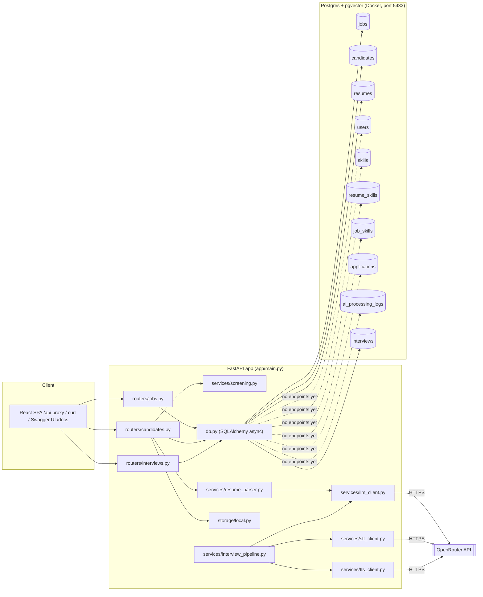

# The Interview Agent — Project Overview

Learning system design by building a real thing: an AI interview platform, in Python.
Code lives at `/Users/amittiwari/Project/StatnativInterviewApp`.

This note is the **big picture**. Deep dives live in sibling notes:

- [[Backend Overview]] — stack, 10-table schema, API surface, services, traces, tests, bugs
- [[AI Architecture]] — OpenRouter gateway, model choices + costs, per-service detail
- [[Frontend Overview]] — React app: API layer, store, pages, real vs. simulated
- [[Synthetic Data — Design]] — the synthetic corpus pipeline
- [[Identity & Access Overview]] — M6 plan: tenants → RBAC → OIDC SSO → MFA → SCIM
- [[Runbook]] — first-time setup, day-to-day commands, migrations, troubleshooting
- **`ProductResearch/`** — [[Enterprise Buyer Research]], [[Cost Savings & ROI Model]],
  [[Competitive Landscape]], [[Enterprise Must-Haves Checklist]], [[UX Review]] — market
  research on the enterprise buyer, ROI case, competitive positioning, the concrete
  feature/integration/compliance checklist for procurement, and a live-app UX audit
  (2026-08-09 pass)

## Why this project exists

Goal is to learn system design **by building**, not by reading theory first. Each milestone
ships a working piece of the app, and the system-design concept behind it (queues, async vs
sync, DB schema shape, multi-tenancy, etc.) gets explained right when it becomes relevant to
the code — not up front.

Full milestone roadmap (M0, M1, a pulled-forward chunk of the voice cascade, and the full
ATS vertical slice are built so far):

| # | Milestone | Concept it teaches | Status |
|---|---|---|---|
| M0 | Repo skeleton, Docker Postgres, `/health`, config/env handling | client→API→DB layering, 12-factor config | ✅ done |
| M1 | Create job (JD) + upload/parse resume → structured JSON via LLM | API design, file handling, relational+JSONB schema | ✅ done |
| — | **Cascaded voice pipeline (STT→LLM→TTS)** — pulled forward, standalone script only | multimodal API integration, conversation-as-state | ✅ prototype done |
| — | **Full ATS vertical slice** — deterministic JD-rubric screening (server-side), jobs/candidates/interviews CRUD, React frontend fully wired to the API (no localStorage) | sync vs async, schema alignment, client↔API contract design | ✅ done (2026-08-09) |
| M2 | Resume scoring against a JD, moved off the request path | sync vs async, polling, LLM-as-judge | 🔶 scoring done deterministically; LLM-as-judge + async polling not started |
| M3 | AI question generation, edit/reorder/regenerate | prompt context injection, idempotency | ✅ done (2026-08-10) |
| M4 | Wire the voice cascade into the app + DB persistence | background workers, why BackgroundTasks stops being enough → Celery+Redis | ⬜ not started |
| M4b | Async → video capture | media-type-as-data, object storage | ⬜ not started |
| M5 | Answer evaluation + aggregated report, human override | pipeline orchestration, explainability | ⬜ not started |
| M6 | Identity & Access — tenant isolation, RBAC, OIDC SSO, MFA, SCIM (enterprise reqs) | authn vs authz, multi-tenant isolation, protocols (OIDC/SAML), provisioning | 🔶 Phase 1 (tenants) + Phase 2 (RBAC) shipped & tested (2026-08-09); master admin auth module (email/password, separate from tenant SSO) shipped & tested (2026-08-09); Phase 3 (tenant OIDC SSO) not started |
| M6b | Deploy to cloud (Cloud Run + Neon + GCS) | dev/prod config parity, pay-per-use cost tradeoffs | ⬜ not started |
| M7 (stretch) | Live, real-time speech/video over WebRTC | real-time systems, latency budgets | ⬜ not started |

## Full ATS vertical slice — done (2026-08-09)

The two halves of the project finally meet. The React frontend (see
[[Frontend Overview]]) is now fully wired to the FastAPI/Postgres backend —
**no more localStorage** for jobs/candidates/interviews.

What was built this session:

1. **Schema aligned to the frontend contract** (migration `a1b2c3d4e5f6`): jobs got
   `rubric`/`versions` (JSONB); candidates got `source`, `tags`, `notes`, `resume_file`,
   `years_exp`, `current_title`, `current_company`, `skills`, `summary`, `experience`,
   `education`, `certifications`; applications got the screening outputs `shortlisted`,
   `decision`, `pipeline_stage`, `scorecard`, `strengths`, `gaps`, `compare_verdict`,
   `ai_note`; and a new **`interviews` table** was added (questions as JSONB) — resolving
   the old review's **D2** (missing interview tables) and the schema gap that ADR-003
   was meant to avoid.
2. **Scoring moved server-side**: `app/services/screening.py` is a Python port of the
   deterministic JD-rubric scorer (`derive_score` / `extract_skills` / `generate_rubric` +
   the 163-skill dictionary from the synthetic corpus). It reproduces the seeded scores
   exactly and is unit-tested (`tests/test_screening.py`). This is deterministic
   keyword matching — the "LLM-as-judge" upgrade remains M2's open question.
3. **Full CRUD API**: jobs (create/patch/`regenerate-rubric`/`save-version`), candidates
   (create with dedupe-by-email + instant screening, patch, re-screen, bulk shortlist/
   decision/stage, resume upload), interviews (CRUD). Flat "view" schemas
   (`app/schemas/`) match the frontend's TypeScript types 1:1.
4. **Idempotent seed script** (`python -m app.seed`): loads the 37 jobs / 228 applications
   / 90 people / 3 interviews from the frontend seed data into Postgres.
5. **Frontend store rewritten** (`frontend/src/store/useAppStore.ts`): `init()` loads
   everything from the API; every mutation calls the API then syncs the returned records
   locally. Vite proxies `/api` → `127.0.0.1:8000`.
6. **PDF resumes**: all 90 seeded CVs were generated as real PDF files
   (`frontend/public/resumes/`), and the candidate UI can now upload a PDF, extract text
   in the browser with pdfjs, and screen it server-side.

Verified end-to-end with a headless-browser run (Playwright): dashboard shows live DB
counts, jobs/candidates/interviews pages render with zero console errors, and adding a
candidate through the UI screens via the backend and persists to Postgres (duplicate-email
path confirmed too). `pytest` 10/10, `tsc` clean, production build succeeds.

## The mental model

Three things run on the machine:

1. **Postgres**, inside Docker — an isolated container that only runs the database.
2. **Python code** (FastAPI app + scripts), running directly via a venv — talks to Postgres
   over `localhost:5433` and to OpenRouter over the internet for every AI call (LLM, speech-to-text,
   text-to-speech).
3. **The React frontend** (Vite dev server on `localhost:5173`) — talks to the FastAPI app
   over `localhost:8000` (proxied as `/api` in dev). The **frontend is now fully wired to the
   API**: jobs, candidates, and interviews all live in Postgres, not localStorage.

Nothing runs as a permanent background service except Postgres. The FastAPI server, Vite, and
any scripts are started/stopped manually.

## Governance & decision-tracking layer

Once the codebase got past a certain size, decisions started living only in conversation —
not durable, not something a future session (or Amit, six weeks later) could reconstruct. So
the project grew a second layer, sitting alongside the code, whose only job is to make
decisions and their reasoning persistent and reviewable:

- **`CLAUDE.md`** (project root) — instructions for any Claude Code session working in this
  repo: how to run it, where things live, and a pointer into everything below.
- **`.claude/product-architect.md`** — a persona document (written by Amit, not generated):
  "act as my demanding principal architect... do not validate my ideas by default." Defines a
  rigorous review process (establish context → identify the decision → interrogate → push past
  vague answers → recommend) and the exact templates for every artifact below.
- **`.claude/commands/`** — three slash commands (`/architect-review`, `/challenge-decision`,
  `/record-decision`) that invoke the persona for specific workflows.
- **`.claude/skills/adr/`, `.claude/skills/product-decision/`** — two focused skills that know
  the exact ADR/PD template and numbering convention, so decisions get recorded consistently
  instead of freehand each time.
- **`.claude/skills/product-architecture-graph/`** — a much bigger addition, see below.
- **`docs/product/`** — `vision.md` (one-screen summary) and `prd.md` (the actual PRD, verbatim).
- **`docs/architecture/decisions/`** — 4 ADRs so far, each recording a real decision already
  made (Docker Postgres, OpenRouter as the AI gateway, the full ATS schema, the cascaded
  voice pipeline) with real tradeoffs, not just the happy-path reasoning.
- **`docs/product-decisions/`** — 2 PDs (async-audio-before-video, cost-sensitive POC scope).
- **`docs/risk-register.md`**, **`docs/implementation-actions.md`** — structured, evidence-cited
  risks and actions, growing as gaps get found (see below — it's about to grow a lot).

Every artifact in this layer follows a strict discipline the persona doc enforces: cite the
actual file/line that supports a claim, mark anything not verified as "Unknown," and never
invent an owner, deadline, or benchmark. It's meant to be argued with, not skimmed past.

## Architecture review in progress (paused at a human_gate)

Amit replaced the single persona doc with something considerably more ambitious:
**`.claude/skills/product-architecture-graph/`** — a 19-node graph-based review workflow
(`references/graph.yaml`), not a single prompt. It defines: `intake` → `repository_mapper` →
a **parallel fan-out** to four independent specialist reviewers (`product_challenger`,
`architecture_challenger`, `stack_evaluator`, `failure_modeler`) → `evidence_judge` (grades
claims, rejects unsupported ones, reconciles contradictions) → `synthesizer` → a **human_gate**
where it must pause for a real decision → (loop, or) → a second parallel fan-out that writes
ADRs, product decisions, diagrams, a risk register, and an action plan → a `final_verdict`.

**What actually ran:** the graph was executed for real, not simulated as one big response — the
four specialist nodes were dispatched as genuinely independent subagents in parallel (Opus for
the two deepest-reasoning roles — architecture and failure modeling — Sonnet for product and
stack), each reading the repo cold and reporting back separately, so they couldn't anchor on
each other's conclusions. Findings were graded before being trusted: the two most consequential
claims were independently re-verified by direct file inspection rather than taken on faith.

**Why this matters more than a single review would:** several bugs were found *independently*
by two different specialist agents approaching from different angles (architecture vs.
failure-mode analysis) — that convergence is a much stronger signal than one reviewer's opinion.
Top findings:

1. **`llm_client.py`'s error handling has a real gap** — it indexes the OpenRouter response with
   no validation, so a timeout or malformed response raises an exception the router's
   `except LLMError` never catches, producing an unhandled 500 instead of a clean error.
2. **Resume uploads can orphan PII on disk** — the file is written *before* the LLM call; if
   that call fails, the file has no DB row and nothing ever cleans it up.
3. **The interview prompt never actually includes resume data** (verified directly — grep
   confirmed it) — only the job description is injected. The PRD's stated differentiator
   ("questions tailored to the role **and candidate**") isn't implemented even in the prototype.
4. **No git repository exists at all** (verified directly — `git rev-parse` fails) — every ADR's
   "Rollback or exit strategy" section assumes revertibility that doesn't currently exist.
5. **ADR-003's own rationale doesn't fully hold** — it was written to avoid a second schema
   migration, but there was no `interviews`/`questions`/`interview_turns` table anywhere, so
   M3/M4 needed one regardless. Relatedly: no table has a `tenant_id`, and two tables have
   globally unique emails — retrofitting M6's multi-tenancy later means altering constraints
   that will have real data depending on them by then.

**Currently blocked on 4 decisions** before the graph's artifact-writing stage runs (per its own
rule: "do not modify production code during review; produce proposed artifacts first," and per
Amit's choice to stop at the human_gate rather than let it write files autonomously):

- **D1** — do a short hardening pass on the ~9 bugs found now, or log them and keep moving to M2?
- **D2** — add the missing `interviews`/`questions`/`interview_turns` tables now (schema's still
  empty), or accept the second migration ADR-003 was meant to avoid?
- **D3** — add `tenant_id` now (cheapest possible time) or stay single-tenant and accept the
  retrofit cost later?
- **D4** — fix the resume-not-in-prompt gap now, or formally descope "candidate-tailored" to
  "JD-tailored only" for MVP and update the PRD?

Nothing has been written to `docs/architecture/decisions/`, `docs/product-decisions/`,
`docs/risk-register.md`, or `docs/implementation-actions.md` as a result of this review yet —
that happens once D1–D4 are resolved and the graph's `artifact_fanout` stage runs.

**Update (2026-08-09):** D2 was resolved by building — the full ATS vertical slice (above)
added the `interviews` table (questions as JSONB, no `interview_turns` table yet — the voice
cascade is still a standalone script), so the M3/M4 schema gap is closed. The slice also
partially addressed D1: scoring moved to a deterministic server-side service (no unhandled
LLM errors on that path anymore), but `llm_client.py`'s error-handling gap and the orphaned
resume file issue still stand. **D3 (tenant_id) is now resolved** — Phase 1 of the M6 plan
([[Identity & Access Overview]]) shipped tenant isolation end-to-end (schema, backend
enforcement, leak tests, frontend header), and Phase 2 (RBAC enforcement) shipped alongside
it. D4 (resume-not-in-prompt) is now **half-resolved** — M3's question generation weaves a
candidate's résumé into authoring-time questions; the live-interview cascade prompt
(`interview_pipeline.py`) is still JD-only, unaddressed because M4 hasn't started.

**Second review pass (2026-08-10)**, run via the same `.claude/product-architect.md` persona
against the state after M3/M6 shipped, surfaced two new findings not present in the first pass
(the codebase didn't have the code that created them yet): **R-011** — `Interview` became a
two-mode entity (shared template vs. one-off personalized artifact) with no DB constraint
preventing the two modes from combining incoherently, unlike the analogous `User` two-mode
design from the admin-auth module, which does have one. **R-012** — the repository has exactly
one git commit despite three major features (M6 Phase 1/2, the admin module, M3) having shipped
since, all sitting uncommitted; every ADR's "rollback strategy" section assumes history that
doesn't exist. Both logged in `docs/risk-register.md` with proposed mitigations
(`docs/implementation-actions.md` IA-012, IA-013). The same pass produced **ADR-007**, a proper
pre-implementation review of M4's execution model — its finding: the roadmap's own
"BackgroundTasks stops being enough → Celery+Redis" framing doesn't fit M4's actual shape (a
live, stateful, per-turn conversation, not decoupled batch work); recommends a
synchronous-then-WebSocket path instead and defers Celery/Redis to M5's report generation,
which is a genuine fit for it. IA-012/014/015 were then actually implemented (CHECK constraint,
shared HTTP client, table naming) the same day.

**IA-002 run, 2026-08-10 — and D1's `llm_client.py` finding is now fully closed, not by
inspection but by reproducing it live.** Three real cascade runs: the clean one measured
full-turn (STT+LLM+TTS) latency at 8.24s and 12.51s — comfortably under ADR-007's ~25–30s
viability threshold, with TTS (not the LLM) the dominant leg at 4.9–5.9s per call. But an
earlier run hit the exact D1 gap from the very first architecture review, live: a 200 response
with no usable `choices` field crashed with an unhandled `KeyError`. Fixed in `chat_completion`
the same session (validate the shape, raise a clean `LLMError`, mirroring `stt_client.py`'s
existing convention) — a direct blocker to finishing the measurement, not a detour from it. A
different run also hit a full 60s timeout on a TTS call with zero response — a second,
still-open reliability finding, logged as an upgrade to R-004 rather than folded into D1, since
it's a distinct failure mode (hang, not malformed shape) with no fix yet. The
orphaned-resume-file half of D1 remains untouched.

## Product research (2026-08-09)

A market research pass validated the core wedge (screening time is the biggest recruiter pain
point; buyers want explainable scores, which our rubric/scorecard model already provides) but
surfaced three gaps worth weighing against the roadmap — full detail in the linked notes:

- **Compliance is a deal-gate, not a nice-to-have.** NYC Local Law 144 (bias audits, candidate
  notice) and EU AI Act "high-risk" classification are treated as table stakes by enterprise
  buyers before AI touches a candidate. We have none of this yet — see
  [[Enterprise Buyer Research]].
- **The resume-not-in-prompt gap (D4, above) is a market-visible weakness, not just internal
  debt.** "Candidate-tailored" questions are an active differentiator competitors market on;
  myInterview is explicitly criticized for keyword-matching-only. See [[Competitive Landscape]].
- **ATS integration (Greenhouse/Lever/Workday), explicitly out of MVP scope, is a top-3
  enterprise buying criterion.** Fine to defer, but should be a conscious "not yet," not a
  surprise at the first serious sales conversation.

ROI story: our own PRD targets (≥50% recruiter-hour reduction) against Tier A/B cost-per-hire
benchmarks produce a defensible, conservative savings estimate — see
[[Cost Savings & ROI Model]] for the model and its (deliberately narrow) assumptions.

**Must-have checklist for enterprise procurement** — [[Enterprise Must-Haves Checklist]] turns
the above into a concrete gap list: SSO/SCIM/RBAC/tenant isolation (all M6, correctly
sequenced), SOC 2/ISO 27001 (blocked on having a stable deployed system to audit — M6b),
AI-hiring-specific compliance (bias audit, candidate disclosure, human-review gate — cheaper to
fold into M6's auth/audit work now than retrofit), and ATS/HRIS/calendar integrations
(rightly deferred, but a confirmed real gap vs. every incumbent in [[Competitive Landscape]]).

## UX review (2026-08-09) — P0 + safe P1 fixed same session

A live-app audit (real Postgres + FastAPI + Vite stack, clicked through both `OrgAppShell` and
`CandidateShell`) surfaced one systemic, high-severity bug plus a set of smaller trust/polish
issues — full detail, repro steps, and file:line citations in [[UX Review]]. Six of the
findings were fixed and re-verified live in the same session (`pytest` 10/10, `npm run build`
clean, fresh direct-navigation repros confirmed):

- **Fixed** — the blank-page-on-deep-link bug: ten pages shared an `if (!x) return null`
  pattern with no loading/not-found state, which silently broke `CandidateDetail`'s real "Copy
  link" feature. Root cause for 5 of the 10: they subscribed to the store's `getJob`/
  `getCandidatesForJob` *functions* instead of the reactive `jobs`/`candidates` arrays, so
  Zustand never re-rendered them once data loaded. Fixing this the naive way (selecting
  `s.candidates.filter().sort()` inline) introduced a second bug — a new-array-every-render
  infinite loop — caught by the live-verification pass and fixed with `useMemo`.
- **Fixed** — the two state-sync bugs: candidate interview mode now routes correctly
  (Voice/Chat → consent flow, Avatar → disclosure flow) instead of always going to Avatar; an
  archived interview no longer shows as startable on the candidate dashboard.
- **Fixed** — the two accessibility failures (unlabeled row buttons in `CandidatesList`/
  `RankedShortlist`, non-semantic clickable cards in `InterviewsList`) that confirmed the WCAG
  2.1 AA gap [[Enterprise Must-Haves Checklist]] had flagged as merely "unverified." Login
  screens' Google/Microsoft/LinkedIn buttons are now `disabled` with a "coming soon" label
  instead of silently dead — real SSO stays [[Identity & Access Overview]] (M6)'s job.
- **Fixed, staying deterministic** — every rubric criterion now quotes the actual JD text it
  was matched from, instead of one boilerplate sentence repeated per tag (no LLM call added).
- **Deliberately left open** — the rubric "editor" on `JobDetail` still doesn't let anyone
  actually change a weight; real inline editing is a feature, not a bug fix, and needs its own
  product decision before it's built.
- What's working and shouldn't be touched: the Candidate Detail scorecard's per-criterion
  evidence citations, the AI disclosure screen's plain-language consent copy, and the design
  token discipline across the app.

## M3 — AI question generation (2026-08-10)

Real question generation, replacing the "Generate interview" button's fake `generating` state
with an actual `chat_completion` call (`app/services/question_generator.py`, the codebase's
second LLM-JSON call site after `resume_parser.py::parse_resume`, and its first one that's
actually on a live request path). Full detail in [[Backend Overview]] /
[[Frontend Overview]]; the highlights:

- **`Interview` gained real `job_id`/`candidate_id` FKs** (previously job linkage was a bare
  `job_title` string with no FK at all) — a deliberate scope expansion beyond the milestone's
  original ask, made because generation needs a reliable JD source and it closes
  [[UX Review]] finding #10 (Job Detail had no link to its interview) as a side effect.
  Confirmed via the Playwright regression: finding #10 flipped FAIL → PASS.
- **Real candidate personalization**, not just JD-only — an interview can optionally be
  generated *for one specific candidate*, weaving their résumé-derived profile (title, company,
  skills, experience — already-structured `Candidate` fields, not a fresh résumé re-parse) into
  the prompt. This is the authoring-time half of the gap-analysis's D4 finding ("the interview
  prompt never includes résumé data") — the separate live-interview cascade prompt in
  `interview_pipeline.py` is untouched and still JD-only.
- **Edit, reorder, and regenerate all shipped**, not just generation: questions are editable
  in place (text + type + difficulty), draggable to reorder (reusing `PipelineBoard.tsx`'s
  native HTML5 DnD pattern), regenerable individually or as a full set — matching PRD §5.2's
  three explicit asks, not just the generation half.
- **Tests**: `tests/test_question_generation.py` (9 tests) — the suite's first LLM-mocked
  tests, monkeypatching `chat_completion` rather than hitting OpenRouter for real.
- **Found and fixed along the way**: `NewInterview.tsx`'s job `<select>` seeded its initial
  state from `jobs[0]?.id` at `useState`'s initializer — which only ever sees the store's
  pre-load empty array, since `jobs` loads asynchronously. The dropdown *looked* selected (the
  browser's no-match fallback rendering), but the real state was permanently empty, so no job
  was ever actually linked. This was a **pre-existing latent bug** (the same pattern existed
  before M3, just harmless then because nothing depended on the value); it became load-bearing
  once generation started requiring a real `jobId`. Fixed with a `useEffect` that seeds `jobId`
  once `jobs` actually arrives.

## Next up

- **M2 (partial)** — scoring is now deterministic and server-side; the "LLM-as-judge" upgrade
  (screening with an LLM instead of keyword matching) and moving screening off the request
  path (`BackgroundTasks` + a polling endpoint) are the remaining pieces.
- **M4** — wire the voice cascade into the app with DB persistence; next natural milestone now
  that M3 (question authoring) is done.
- **M6** — Phase 1 (tenant isolation) and Phase 2 (RBAC enforcement) are shipped and tested
  ([[Identity & Access Overview]]); a master admin auth module (real email/password login +
  session cookie, one cross-tenant operator account — creates tenants, creates/approves users,
  authors tenant-scoped Practice Tests) also shipped, out of the phase sequence, since the
  immediate need was platform-side provisioning rather than tenant SSO — it does **not**
  replace or advance Phase 3. Next is still Phase 3, real OIDC SSO against a dev Keycloak
  instance, which is what finally replaces the `X-Tenant-Id`/`X-User-Email` dev-header
  stand-ins for *tenant users* with a real login.
- Then D1's hardening list from the architecture review (LLM error handling, orphaned files,
  git repo) and D4.
- Frontend-side: tests (Vitest for the API client + store), loading/error states, 409-conflict
  UX — see [[Frontend Overview]] → "Next up".
