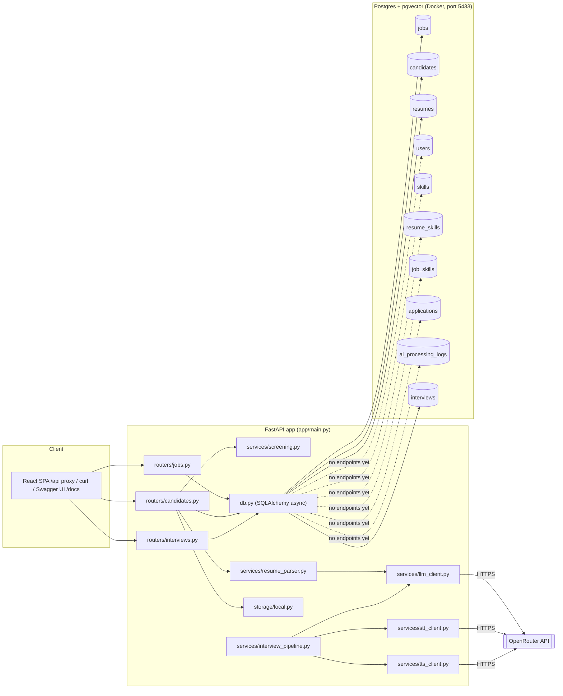

# The Interview Agent — Project Overview

Learning system design by building a real thing: an AI interview platform, in Python.
Code lives at `/Users/amittiwari/Project/StatnativInterviewApp`.

This note is the **big picture**. Deep dives live in sibling notes:

- [[Backend Overview]] — stack, 10-table schema, API surface, services, traces, tests, bugs
- [[AI Architecture]] — OpenRouter gateway, model choices + costs, per-service detail
- [[Frontend Overview]] — React app: API layer, store, pages, real vs. simulated
- [[Synthetic Data — Design]] — the synthetic corpus pipeline
- [[Runbook]] — first-time setup, day-to-day commands, migrations, troubleshooting

## Why this project exists

Goal is to learn system design **by building**, not by reading theory first. Each milestone
ships a working piece of the app, and the system-design concept behind it (queues, async vs
sync, DB schema shape, multi-tenancy, etc.) gets explained right when it becomes relevant to
the code — not up front.

Full milestone roadmap (M0, M1, a pulled-forward chunk of the voice cascade, and the full
ATS vertical slice are built so far):

| # | Milestone | Concept it teaches | Status |
|---|---|---|---|
| M0 | Repo skeleton, Docker Postgres, `/health`, config/env handling | client→API→DB layering, 12-factor config | ✅ done |
| M1 | Create job (JD) + upload/parse resume → structured JSON via LLM | API design, file handling, relational+JSONB schema | ✅ done |
| — | **Cascaded voice pipeline (STT→LLM→TTS)** — pulled forward, standalone script only | multimodal API integration, conversation-as-state | ✅ prototype done |
| — | **Full ATS vertical slice** — deterministic JD-rubric screening (server-side), jobs/candidates/interviews CRUD, React frontend fully wired to the API (no localStorage) | sync vs async, schema alignment, client↔API contract design | ✅ done (2026-08-09) |
| M2 | Resume scoring against a JD, moved off the request path | sync vs async, polling, LLM-as-judge | 🔶 scoring done deterministically; LLM-as-judge + async polling not started |
| M3 | AI question generation, edit/reorder/regenerate | prompt context injection, idempotency | ⬜ not started |
| M4 | Wire the voice cascade into the app + DB persistence | background workers, why BackgroundTasks stops being enough → Celery+Redis | ⬜ not started |
| M4b | Async → video capture | media-type-as-data, object storage | ⬜ not started |
| M5 | Answer evaluation + aggregated report, human override | pipeline orchestration, explainability | ⬜ not started |
| M6 | JWT auth, tenant isolation, RBAC | authn vs authz, multi-tenant isolation | ⬜ not started |
| M6b | Deploy to cloud (Cloud Run + Neon + GCS) | dev/prod config parity, pay-per-use cost tradeoffs | ⬜ not started |
| M7 (stretch) | Live, real-time speech/video over WebRTC | real-time systems, latency budgets | ⬜ not started |

## Full ATS vertical slice — done (2026-08-09)

The two halves of the project finally meet. The React frontend (see
[[Frontend Overview]]) is now fully wired to the FastAPI/Postgres backend —
**no more localStorage** for jobs/candidates/interviews.

What was built this session:

1. **Schema aligned to the frontend contract** (migration `a1b2c3d4e5f6`): jobs got
   `rubric`/`versions` (JSONB); candidates got `source`, `tags`, `notes`, `resume_file`,
   `years_exp`, `current_title`, `current_company`, `skills`, `summary`, `experience`,
   `education`, `certifications`; applications got the screening outputs `shortlisted`,
   `decision`, `pipeline_stage`, `scorecard`, `strengths`, `gaps`, `compare_verdict`,
   `ai_note`; and a new **`interviews` table** was added (questions as JSONB) — resolving
   the old review's **D2** (missing interview tables) and the schema gap that ADR-003
   was meant to avoid.
2. **Scoring moved server-side**: `app/services/screening.py` is a Python port of the
   deterministic JD-rubric scorer (`derive_score` / `extract_skills` / `generate_rubric` +
   the 163-skill dictionary from the synthetic corpus). It reproduces the seeded scores
   exactly and is unit-tested (`tests/test_screening.py`). This is deterministic
   keyword matching — the "LLM-as-judge" upgrade remains M2's open question.
3. **Full CRUD API**: jobs (create/patch/`regenerate-rubric`/`save-version`), candidates
   (create with dedupe-by-email + instant screening, patch, re-screen, bulk shortlist/
   decision/stage, resume upload), interviews (CRUD). Flat "view" schemas
   (`app/schemas/`) match the frontend's TypeScript types 1:1.
4. **Idempotent seed script** (`python -m app.seed`): loads the 37 jobs / 228 applications
   / 90 people / 3 interviews from the frontend seed data into Postgres.
5. **Frontend store rewritten** (`frontend/src/store/useAppStore.ts`): `init()` loads
   everything from the API; every mutation calls the API then syncs the returned records
   locally. Vite proxies `/api` → `127.0.0.1:8000`.
6. **PDF resumes**: all 90 seeded CVs were generated as real PDF files
   (`frontend/public/resumes/`), and the candidate UI can now upload a PDF, extract text
   in the browser with pdfjs, and screen it server-side.

Verified end-to-end with a headless-browser run (Playwright): dashboard shows live DB
counts, jobs/candidates/interviews pages render with zero console errors, and adding a
candidate through the UI screens via the backend and persists to Postgres (duplicate-email
path confirmed too). `pytest` 10/10, `tsc` clean, production build succeeds.

## The mental model

Three things run on the machine:

1. **Postgres**, inside Docker — an isolated container that only runs the database.
2. **Python code** (FastAPI app + scripts), running directly via a venv — talks to Postgres
   over `localhost:5433` and to OpenRouter over the internet for every AI call (LLM, speech-to-text,
   text-to-speech).
3. **The React frontend** (Vite dev server on `localhost:5173`) — talks to the FastAPI app
   over `localhost:8000` (proxied as `/api` in dev). The **frontend is now fully wired to the
   API**: jobs, candidates, and interviews all live in Postgres, not localStorage.

Nothing runs as a permanent background service except Postgres. The FastAPI server, Vite, and
any scripts are started/stopped manually.

## Governance & decision-tracking layer

Once the codebase got past a certain size, decisions started living only in conversation —
not durable, not something a future session (or Amit, six weeks later) could reconstruct. So
the project grew a second layer, sitting alongside the code, whose only job is to make
decisions and their reasoning persistent and reviewable:

- **`CLAUDE.md`** (project root) — instructions for any Claude Code session working in this
  repo: how to run it, where things live, and a pointer into everything below.
- **`.claude/product-architect.md`** — a persona document (written by Amit, not generated):
  "act as my demanding principal architect... do not validate my ideas by default." Defines a
  rigorous review process (establish context → identify the decision → interrogate → push past
  vague answers → recommend) and the exact templates for every artifact below.
- **`.claude/commands/`** — three slash commands (`/architect-review`, `/challenge-decision`,
  `/record-decision`) that invoke the persona for specific workflows.
- **`.claude/skills/adr/`, `.claude/skills/product-decision/`** — two focused skills that know
  the exact ADR/PD template and numbering convention, so decisions get recorded consistently
  instead of freehand each time.
- **`.claude/skills/product-architecture-graph/`** — a much bigger addition, see below.
- **`docs/product/`** — `vision.md` (one-screen summary) and `prd.md` (the actual PRD, verbatim).
- **`docs/architecture/decisions/`** — 4 ADRs so far, each recording a real decision already
  made (Docker Postgres, OpenRouter as the AI gateway, the full ATS schema, the cascaded
  voice pipeline) with real tradeoffs, not just the happy-path reasoning.
- **`docs/product-decisions/`** — 2 PDs (async-audio-before-video, cost-sensitive POC scope).
- **`docs/risk-register.md`**, **`docs/implementation-actions.md`** — structured, evidence-cited
  risks and actions, growing as gaps get found (see below — it's about to grow a lot).

Every artifact in this layer follows a strict discipline the persona doc enforces: cite the
actual file/line that supports a claim, mark anything not verified as "Unknown," and never
invent an owner, deadline, or benchmark. It's meant to be argued with, not skimmed past.

## Architecture review in progress (paused at a human_gate)

Amit replaced the single persona doc with something considerably more ambitious:
**`.claude/skills/product-architecture-graph/`** — a 19-node graph-based review workflow
(`references/graph.yaml`), not a single prompt. It defines: `intake` → `repository_mapper` →
a **parallel fan-out** to four independent specialist reviewers (`product_challenger`,
`architecture_challenger`, `stack_evaluator`, `failure_modeler`) → `evidence_judge` (grades
claims, rejects unsupported ones, reconciles contradictions) → `synthesizer` → a **human_gate**
where it must pause for a real decision → (loop, or) → a second parallel fan-out that writes
ADRs, product decisions, diagrams, a risk register, and an action plan → a `final_verdict`.

**What actually ran:** the graph was executed for real, not simulated as one big response — the
four specialist nodes were dispatched as genuinely independent subagents in parallel (Opus for
the two deepest-reasoning roles — architecture and failure modeling — Sonnet for product and
stack), each reading the repo cold and reporting back separately, so they couldn't anchor on
each other's conclusions. Findings were graded before being trusted: the two most consequential
claims were independently re-verified by direct file inspection rather than taken on faith.

**Why this matters more than a single review would:** several bugs were found *independently*
by two different specialist agents approaching from different angles (architecture vs.
failure-mode analysis) — that convergence is a much stronger signal than one reviewer's opinion.
Top findings:

1. **`llm_client.py`'s error handling has a real gap** — it indexes the OpenRouter response with
   no validation, so a timeout or malformed response raises an exception the router's
   `except LLMError` never catches, producing an unhandled 500 instead of a clean error.
2. **Resume uploads can orphan PII on disk** — the file is written *before* the LLM call; if
   that call fails, the file has no DB row and nothing ever cleans it up.
3. **The interview prompt never actually includes resume data** (verified directly — grep
   confirmed it) — only the job description is injected. The PRD's stated differentiator
   ("questions tailored to the role **and candidate**") isn't implemented even in the prototype.
4. **No git repository exists at all** (verified directly — `git rev-parse` fails) — every ADR's
   "Rollback or exit strategy" section assumes revertibility that doesn't currently exist.
5. **ADR-003's own rationale doesn't fully hold** — it was written to avoid a second schema
   migration, but there was no `interviews`/`questions`/`interview_turns` table anywhere, so
   M3/M4 needed one regardless. Relatedly: no table has a `tenant_id`, and two tables have
   globally unique emails — retrofitting M6's multi-tenancy later means altering constraints
   that will have real data depending on them by then.

**Currently blocked on 4 decisions** before the graph's artifact-writing stage runs (per its own
rule: "do not modify production code during review; produce proposed artifacts first," and per
Amit's choice to stop at the human_gate rather than let it write files autonomously):

- **D1** — do a short hardening pass on the ~9 bugs found now, or log them and keep moving to M2?
- **D2** — add the missing `interviews`/`questions`/`interview_turns` tables now (schema's still
  empty), or accept the second migration ADR-003 was meant to avoid?
- **D3** — add `tenant_id` now (cheapest possible time) or stay single-tenant and accept the
  retrofit cost later?
- **D4** — fix the resume-not-in-prompt gap now, or formally descope "candidate-tailored" to
  "JD-tailored only" for MVP and update the PRD?

Nothing has been written to `docs/architecture/decisions/`, `docs/product-decisions/`,
`docs/risk-register.md`, or `docs/implementation-actions.md` as a result of this review yet —
that happens once D1–D4 are resolved and the graph's `artifact_fanout` stage runs.

**Update (2026-08-09):** D2 was resolved by building — the full ATS vertical slice (above)
added the `interviews` table (questions as JSONB, no `interview_turns` table yet — the voice
cascade is still a standalone script), so the M3/M4 schema gap is closed. The slice also
partially addressed D1: scoring moved to a deterministic server-side service (no unhandled
LLM errors on that path anymore), but `llm_client.py`'s error-handling gap and the orphaned
resume file issue still stand. D3 (tenant_id) and D4 (resume-not-in-prompt) are untouched —
still single-tenant, still JD-tailored-only.

## Next up

- **M2 (partial)** — scoring is now deterministic and server-side; the "LLM-as-judge" upgrade
  (screening with an LLM instead of keyword matching) and moving screening off the request
  path (`BackgroundTasks` + a polling endpoint) are the remaining pieces.
- **M3** — AI question generation wired into the UI (currently only a draft rubric endpoint exists).
- Then D1's hardening list from the architecture review (LLM error handling, orphaned files,
  git repo) and D3/D4.
- Frontend-side: tests (Vitest for the API client + store), loading/error states, 409-conflict
  UX — see [[Frontend Overview]] → "Next up".
