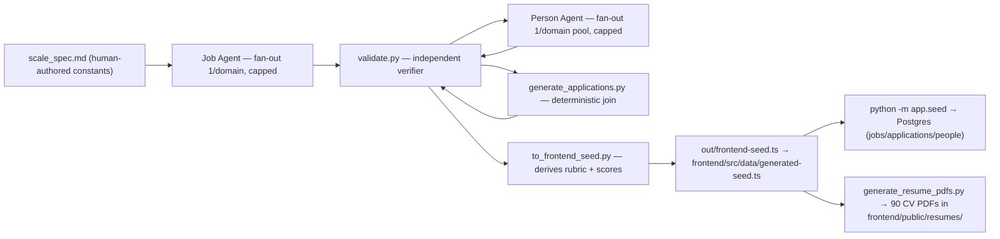

# Synthetic Data Pipeline — Design & Build Status

Companion to [[Project Overview]] and [[Frontend Overview]]. Records how the synthetic jobs +
CV dataset for the app is designed, why it's built as two agents, and where the build stands.

## The question: do we need two dedicated agents?

**Answer: yes — a Job Agent and a CV (Person) Agent, run as a two-stage pipeline.** The
reasoning is the "stop rule" of task-graph design: *where does the work split into pieces that
never read each other's results?*

1. **The split is real, not fake.** Jobs never depend on CVs; CVs *do* depend on jobs (a CV's
   skills must cover the job's must-haves). That's a genuine dependency edge → jobs must
   complete before CVs start. A single agent generating "job + its 5 CVs" together would work
   for 1 job, but sacrifices reuse (regenerating CVs without touching jobs) and parallel fan-out.
2. **Different products, different quality bars.** A job spec and a CV are different schemas
   with different validation. Mixed in one prompt, the LLM shortcuts the CVs.
3. **Scale.** 150 CVs can't live in one context; a dedicated CV stage fans out per job.

The honest counter-argument (single agent per job = perfect job↔CV coupling, ~zero
orchestration) is documented so the tradeoff is visible. It's the right call only if jobs and
candidates are never reused — not true for an ATS.

## The task graph

Patterns applied: diamond shape (fan-out → verify in a **separate context** → merge); one
writer per file; hard cap on concurrent agents; a **human gate** on the pilot before scaling;
and the "fix the rules, not the output" rule — the first verifier run flagged 18 false gaps,
and the right fix was relaxing the timeline rule to allow 1-month transitions, not editing data.

## Design decisions (made)

| Decision | Choice | Why |
|---|---|---|
| CV ↔ job model | **Shared pool, 1–3 applications per person** | Realistic; exercises the `applications` table (fully wired now — every app row carries its scorecard/strengths/gaps from screening) |
| Scores | **Raw signals only in data** | Scores/scorecards/verdicts are *derived* deterministically — in the converter when the seed is built, and in `app/services/screening.py` for anything added through the API |
| Format | **Canonical JSON in `data/synthetic/` + converters** | Same data can emit the frontend seed, Postgres rows (via `app.seed`), and PDF resumes without re-authoring |

## Canonical model (raw signals only)

- **Job** — `requiredSkills[{name, level(must-have/nice-to-have/disqualifying), weight}]`; weights sum to 100. Rubric *derived* from this.
- **Person** — the CV: identity, skills, experience timeline, education, certifications, summary, strengths/gaps, resumeText.
- **Application** — join: person → job, `status`, `appliedAt`. Maps to the backend `applications` table.

## Pilot build (this session)

Ran for real, in order: 3 Job Agents in parallel (one per domain) → 3 Person Agents in
parallel (one per domain pool) → deterministic applications → verifier → converter.

Result: **3 jobs (Go Backend, React Frontend, Data Engineer), 15 people, 16 applications,
every job ≥ 5 applicants, one person applying to 2 jobs.** One concurrency artifact observed:
two parallel writers independently picked the same phone number; one self-fixed it, and the
verifier confirms zero duplicate emails/phones now. Verifier passes: `0 problems`.

Derived scores behave as intended — e.g. Priya Nataraj scores **59** for the Go role but **68**
for the Data Engineer role from the *same* CV, because coverage is job-relative.

## Scale-out (37 jobs / 90 people / 228 applications)

Human gate passed; the full build is done and wired into the app.

| Stage | Agents | Result |
|---|---|---|
| Jobs | 9 Job Agents in parallel (1/domain) | job-004..job-037 written; all schema-valid (weights sum 100, exact enums) |
| People | 9 Person Agents in parallel (1/domain pool) | person-016..person-090 written; pools sized per `scale_spec.md` (backend +9, frontend +5, data +7, mobile +8, infra +12, security +9, qa +6, architecture +10, ai +9) |
| Join | `generate_applications.py` (deterministic, algorithmic) | **228 applications**; pilot's 16 kept verbatim; 9 cross-domain edges from `scale_spec.md` exercised; per-person 1–3 apps |
| Verify | `validate.py` | `VALIDATION PASSED — 37 jobs, 90 people, 228 applications, 0 problems` |
| Derive | `to_frontend_seed.py` | 37 jobs / 228 candidates → `out/frontend-seed.ts` **and** `frontend/src/data/generated-seed.ts` (resumeFile now points at `.pdf`) |
| PDFs | `generate_resume_pdfs.py` (fpdf2 + Arial Unicode) | 90 real CV PDFs → `frontend/public/resumes/` (round-trip verified: pdfjs text extraction matches); 10 extra samples in `sample-resumes/` for upload testing |
| Seed DB | `python -m app.seed` | Idempotent: loads the 37 jobs / 228 applications / 90 people into Postgres from `generated-seed.ts`; the store no longer imports it — the app reads everything from the API |

Status diversity is realistic: 34 Open, 1 Draft (job-029-qa-automation), 1 Paused (job-020-sre),
1 Closed (job-036-cv-engineer) — the Dashboard "Open jobs" stat reads 34.

**Two algorithmic bugs caught and fixed during the join:** (1) one-pass assignment let the
frontend-platform strong fit get consumed as a filler for earlier jobs, leaving job-011 with no
full must-have cover → switched to a two-pass approach (reserve each job's strongest candidate
first, then fill); (2) coverage-greedy filling capped the strongest people early → filler order
now balances on fewest-apps-first. Verifier is the tripwire, not the fix.

## Open items (small, optional)

1. **Rubric weights in the frontend rubric view** — JobDetail sums weights and shows `Total weight:
   {totalWeight}%`; synthetic rubrics sum to 100 but include nice-to-have/disqualifying weights,
   so the "100%" line reads slightly off for jobs that carry nice-to-haves.
2. **Interviews still demo** — the 3 interviews the app shows come from `app/seed.py`'s
   `SEED_INTERVIEWS` (hardcoded in Python because `generated-seed.ts` isn't JSON-parseable) and
   reference demo job titles (Senior Backend Engineer, Staff SRE), not the synthetic 37.
3. **`npm run lint` blocked** — oxlint's `darwin-universal` platform binding is missing from
   `node_modules` (pre-existing); tsc is the working gate.

## Where it lives

Code + data: `data/synthetic/` and `scripts/synthetic/` in the repo.
Specs: `scripts/synthetic/pilot_spec.md` (shared rules) + `scripts/synthetic/scale_spec.md`
(authoritative constants for the full build). README + commands: `data/synthetic/README.md`.
