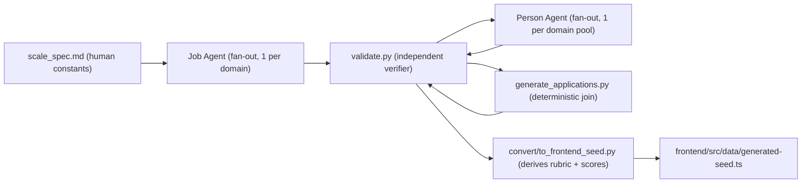

# Synthetic Data (data/synthetic)

Canonical synthetic dataset for the Interview Agent, generated by a two-agent pipeline.

> **FULL BUILD — 37 jobs / 90 people / 228 applications**, wired into the frontend via
> `frontend/src/data/generated-seed.ts`. Spec: `scripts/synthetic/scale_spec.md`; shared
> rules from the pilot in `scripts/synthetic/pilot_spec.md`.

## Principle

**Raw signals in the data, derived state in the converters.**
The canonical files (`jobs/`, `people/`, `applications/`) contain *no* scores, no verdicts,
no rubrics — those are computed deterministically downstream (see `convert/`). This keeps one
source of truth and makes the derived values reproducible and arguable-with.

## Folder layout

| Path | Contents |
|---|---|
| `schema/*.json` | The contract every file must satisfy. Hand-rolled validator in `validate.py`. |
| `jobs/job-*.json` | 1 file per job posting. `requiredSkills` carries name/level/weight (weights sum to 100). |
| `people/person-*.json` | 1 file per unique candidate CV (person). Never duplicated per job. |
| `applications/app-*.json` | The join: person → job, with `status` and `appliedAt`. Maps to the backend `applications` table. |
| `index.json` | Regenerated registry + coverage report (every job ≥ 5 apps). |
| `out/` | Derived artifacts (e.g. `frontend-seed.ts`) — build outputs, not canonical. |

## Pipeline



One writer per file. Every edge between stages is real (each stage consumes the previous
stage's files). Validation runs as a separate pass so no agent grades its own work.

## Commands

```bash
cd /Users/amittiwari/Project/StatnativInterviewApp

# regenerate the join layer (algorithmic; pilot + cross-domain edges preserved)
python3 scripts/synthetic/generate_applications.py

# independent verification — schema, integrity, coverage, uniqueness, timelines, skill spread
python3 scripts/synthetic/validate.py

# derive the frontend seed (rubric + deterministic scores) → out/frontend-seed.ts
# and frontend/src/data/generated-seed.ts (what the app consumes)
python3 scripts/synthetic/convert/to_frontend_seed.py

# regenerate the registry
python3 scripts/synthetic/build_index.py
```

## Scoring formula (derived, tunable)

    match_ratio = matched_musthave_weight / total_musthave_weight
    nice_bonus  = 5 * (matched_nice_weight / total_nice_weight)
    score       = round(30 + 65 * match_ratio + nice_bonus), capped at 99

The widened must-have band (65 points) keeps deliberate weak candidates genuinely weak while
strong fits land 88–99. Calibrated during the pilot review; see `convert/to_frontend_seed.py`.
