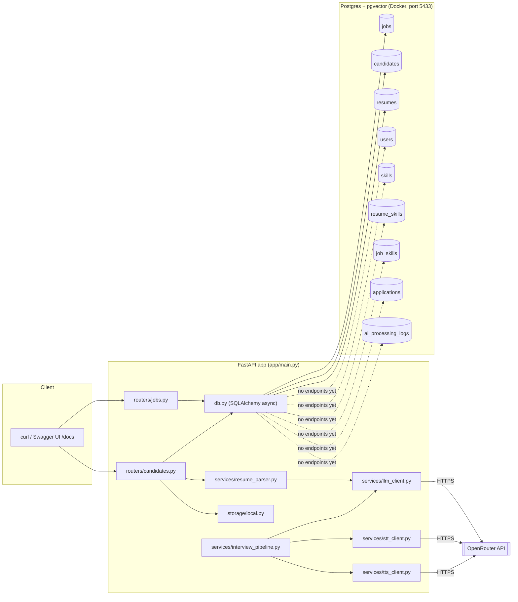

# System Overview Diagram

Request flow through the current implementation (M0/M1 + prototype voice cascade). Tables
marked "no endpoints yet" exist in the schema for upcoming milestones but nothing writes to
them yet.

`interview_pipeline.py` (the STT→LLM→TTS cascade) is currently only exercised by
`scripts/test_interview_pipeline.py` — it isn't reachable through any HTTP endpoint yet
(that's M4).
